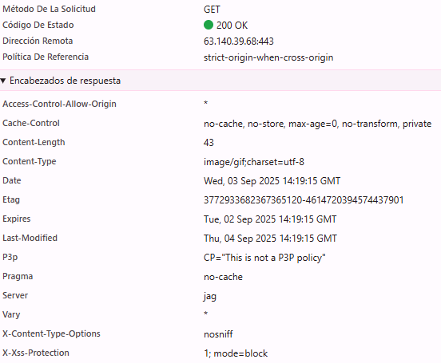
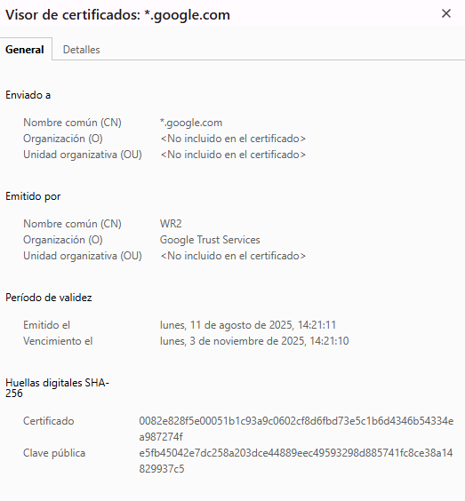
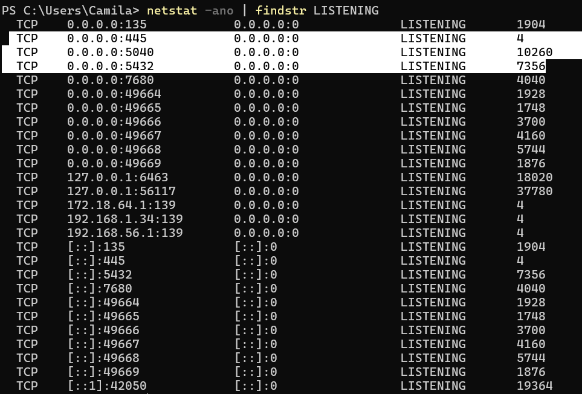

# Actividad 1: Introducción a DevOps y DevSecOps  
**Nombre:** Ariana Camila Lopez Julcarima
**Fecha:** 03/09/2025  
**Tiempo invertido:** 04:00  

**Entorno utilizado:**  
Laptop personal con navegador Chrome y sistema operativo Windows 11.

---

## 4.1 DevOps vs. Cascada tradicional
El desarrollo de software ha cambiado mucho con el tiempo. Antes se usaban métodos muy estructurados como el modelo en cascada, donde todo se hacía en un orden fijo. El modelo en cascada sigue un flujo lineal de fases donde primero se realiza el análisis, luego el diseño, más adelante la construcción, después las pruebas y finalmente el despliegue. En este esquema el feedback llega tarde y en grandes lotes, lo que implica más riesgo porque los defectos suelen descubrirse solo al final del ciclo, como se describe en The Phoenix Project 2013.

DevOps surge como alternativa moderna y busca integrar desarrollo y operaciones en ciclos continuos con entregas pequeñas y automatizadas. Esto permite validar más rápido y corregir antes de que los problemas crezcan. El reporte Google State of DevOps 2023 muestra que los equipos con prácticas DevOps reducen de manera significativa tanto el tiempo de entrega como la tasa de fallos en producción.

**Pregunta Retadora**
Un contexto donde el modelo en cascada todavía puede ser razonable es el desarrollo de software para militares. En este tipo de proyectos se requieren certificaciones muy estrictas que obliga a llevar un proceso documentado y validaciones completas antes de publicar una versión. Además, gran parte del software está ligado a hardware especializado y un error puede terminar en fallas de seguridad muy costosas o irreparables.

En este escenario se pierde velocidad y flexibilidad en los cambios, pero se gana en confiabilidad y estabilidad. Aunque no se aprovecha toda la agilidad que ofrece DevOps, lo más importante es cumplir con las normas y garantizar que el sistema funcione de manera segura desde el primer despliegue.

## 4.2 Ciclo de dos pasos y silos
En un ciclo de dos pasos donde primero está el desarrollo y luego la operatividad, sin integración continua, aparecen varias limitaciones. Una de ellas es que los cambios se acumulan en grandes lotes, lo que provoca que los errores se descubran tarde y sea más difícil identificar su causa. Otra limitación es la generación de colas de defectos, ya que los equipos encuentran problemas pero no los corrigen de inmediato, lo que retrasa la entrega y eleva el costo de integración. Este esquema refuerza el trabajo en silos, porque cada área se concentra en su parte y el handoff entre equipos se vuelve lento y con poca comunicación, lo que genera un desbalance de información entre ambas áreas.

**Pregunta Retadora**
Un anti-patrón común es el throw over the wall, que ocurre cuando el equipo de desarrollo termina su trabajo y lo entrega a operaciones como si solo se tratara de pasar la pelota al otro lado del muro. Esto provoca que los de operaciones reciban el software sin suficiente contexto y con poca docoumentación, lo que hace más difícil resolver problemas y aumenta el tiempo medio de recuperación cuando ocurre un incidente.

Otro anti-patrón es ver la seguridad solo como una auditoría tardía, aplicando controles al final del proyecto en lugar de integrarlos desde el inicio. Esto genera retrabajos porque muchas veces se descubren vulnerabilidades cuando ya el sistema está casi terminado y corregir en ese punto cuesta más esfuerzo y tiempo. Además, pueden repetirse las mismas fallas en versiones futuras porque la seguridad nunca se incluyó como parte del proceso diario.

---

## 4.3 Principios y beneficios de DevOps
La integración continua (CI) busca que los cambios de código sean pequeños y frecuentes, lo que permite detectarlos y probarlos de inmediato. Esto se complementa con pruebas automatizadas que se ejecutan cerca del código, reduciendo errores antes de llegar a producción. La entrega continua (CD) se centra en que las mejoras pasen automáticamente desde la fase de integración hasta los entornos de prueba y producción, asegurando despliegues frecuentes. Esto requiere una colaboración constante entre desarrollo y operaciones para que el software llegue a los usuarios sin interrupciones y con menor riesgo.

**Relación con Agile:**  
Una práctica Agile que influye directamente en el pipeline son las reuniones diarias. En estas reuniones cada miembro comparte qué hizo, qué planea hacer y qué obstáculos encontró. Esa información permite que el equipo decida con mayor claridad qué cambios están listos para promover en el pipeline y cuáles conviene bloquear o revisar antes. De la misma forma, en las retrospectivas se analizan incidentes pasados y se definen mejoras que luego se incorporan como reglas en el proceso de integración y despliegue.

Un indicador observable puede ser el tiempo que pasa desde que un Pull Request es aprobado o mergeado hasta que el cambio se despliega en el entorno de pruebas. Este dato refleja la agilidad del equipo y no depende de información financiera. Se puede obtener fácilmente revisando los metadatos del repositorio, que muestran la fecha de aprobación o de merge del PR, y comparándolos con los registros de despliegue guardados en las bitácoras. De esa forma se consigue una medida simple y verificable del nivel de integración entre desarrollo y operaciones.

---

## 4.4 Evolución a DevSecOps
El modelo DevOps tradicional se enfoca en la velocidad y la colaboración, pero carece de formas claras de integrar la seguridad de manera sistemática. A partir de esa necesidad aparece DevSecOps, cuyo principio es incluir la seguridad desde el inicio del pipeline y no dejarla como una revisión al final.

**SAST vs DAST**  
SAST (Static Application Security Testing) se refiere al análisis estático del código antes de que la aplicación se ejecute. Normalmente se ubica justo después del proceso de build dentro del pipeline y permite detectar vulnerabilidades en una etapa temprana.

Por otro lado, DAST (Dynamic Application Security Testing) corresponde a pruebas de seguridad dinámicas que se realizan con la aplicación en ejecución. Evalúa endpoints, manejo de sesiones y validaciones en tiempo real, por lo que suele ejecutarse en entornos de staging o integración, donde el sistema ya corre de forma similar a producción.

**Gates mínimo de seguridad**
- **Umbral 1 (SAST)**: no se permite avanzar si existen vulnerabilidades críticas o altas (CVSS ≥ 7.0). El análisis debe mostrar únicamente hallazgos medios o bajos antes de promover a producción.

- **Umbral 2 (DAST)**: las pruebas dinámicas deben cubrir al menos el 85% de los endpoints marcados como sensibles, como autenticación, pagos o gestión de sesiones.

**Política de excepción:**  
Cuando se detecta una vulnerabilidad que no bloquea de forma inmediata la operación, el equipo puede solicitar una excepción con una vigencia máxima de 14 días. El responsable asignado será el encargado de DevSecOps, quien deberá registrar la vulnerabilidad en el backlog y definir un plan de acción concreto, por ejemplo aplicar un parche de proveedor pendiente, reforzar validaciones en el código o limitar el acceso al servicio afectado. Al cumplirse el plazo, la excepción caduca automáticamente y la vulnerabilidad debe estar corregida o, en caso contrario, el cambio no podrá avanzar en el pipeline.

**Pregunta Retadora**
Evitar el llamado teatro de seguridad significa no limitarse a llenar checklists o pasar auditorías superficiales sin que eso realmente reduzca el riesgo. Muchas veces se generan reportes solo para cumplir con el proceso mientras las vulnerabilidades siguen apareciendo o tardan semanas en resolverse. Para comprobar que la seguridad aporta valor real, se pueden usar señales de eficacia como la reducción de hallazgos repetidos a menos del 10% entre escaneos sucesivos y un tiempo de remediación corto, por ejemplo resolver vulnerabilidades críticas en menos de 72 horas desde su detección. Estas métricas son visibles en los reportes del pipeline y muestran que la seguridad está integrada en el flujo de trabajo y actúa como un habilitador del desarrollo en lugar de convertirse en un obstáculo burocrático.

---

## 4.5 CI/CD y estrategias de despliegue

**Estrategia elegida**  
Un pipeline CI/CD moderno no solo integra y entrega código, también define estrategias de despliegue que balancean riesgo vs. velocidad. Para un microservicio crítico como autenticación, se recomienda la estrategia canary deployment, esta estrategia libera la nueva versión a un subconjunto controlado de usuarios y observa métricas antes de expandirla.

**Riesgos vs Mitigaciones:**

| Riesgo                           | Mitigación técnica                                                                 |
|----------------------------------|------------------------------------------------------------------------------------|
| Falsos positivos en métricas     | Correlación entre métricas de sistema como errores 5xx y latencia con métricas de producto como conversiones y registros |
| Sesgos en la muestra de usuarios | Selección aleatoria de usuarios en el canary y segmentación geográfica controlada   |
| Incompatibilidad con dependencias| Pruebas de integración previa con microservicios relacionados y contratos de API compartidos |
| Fallos de seguridad no detectados| Escaneo DAST en entorno canary antes de promover a toda la base de usuarios         |

**KPI y umbral:**  
Un KPI primario para un despliegue canary puede ser la tasa de errores HTTP 5xx. El umbral definido es no superar 0.1 por ciento de errores dentro de una ventana de observación de una hora después de la liberación. Si el valor se mantiene por debajo de ese límite, el despliegue puede promoverse al resto de usuarios. Si se supera el umbral, el despliegue debe abortarse y ejecutarse un rollback inmediato.

**Pregunta retadora:** 
Aunque un KPI técnico como la tasa de errores 5xx se mantenga bajo control, puede suceder que una métrica de producto caiga y que menos usuarios logren completar una acción importante como el registro. En este caso el sistema sigue siendo estable desde el punto de vista técnico, pero la experiencia del usuario o la funcionalidad de negocio se ven afectadas de manera negativa. Por esa razón es necesario que ambos tipos de métricas convivan en el gate. Las métricas técnicas confirman que la infraestructura y el software funcionan sin fallos graves, mientras que las métricas de producto permiten validar que lo entregado realmente cumple con su objetivo para el usuario final y aporta valor al negocio.

---

## 4.6 Fundamentos prácticos sin comandos 

### 4.6.1 HTTP – contrato observable

- **Método:** GET  
- **Código de estado:** 200  
- **Cabeceras observadas:**  
  - `Cache-Control: no-cache, no-store, max-age=0...` → indica que la respuesta no debe almacenarse en caché.
  - `X-Xss-Protection` → esta cabecera activa un filtro en el navegador para prevenir ataques de cross-site scripting (XSS).

Esta evidencia muestra que la aplicación responde correctamente a solicitudes GET con código 200. La cabecera Cache-Control afecta el rendimiento y la eficiencia de la caché, evitando que el navegador almacene datos sensibles. Por otro lado, X-Xss-Protection contribuye a la seguridad del usuario, bloqueando intentos de ataques de inyección de scripts en el cliente. Ambas cabeceras permiten verificar que el contrato HTTP está cumpliéndose de manera correcta, asegurando tanto la funcionalidad como la protección básica en tránsito.

---

### 4.6.2 DNS – nombres y TTL

- **Tipo de registro:** CNAME que apunta a `d3qtt7lrnx5qh6.cloudfront.net.uni.pe`, el cual resuelve en varios registros tipo A.   
- **TTL:** 6570 s

Un TTL de casi dos horas significa que las respuestas de este dominio permanecerán en caché durante ese tiempo antes de que los resolvers consulten de nuevo.  
Esto ayuda al rendimiento, ya que reduce la cantidad de consultas DNS y mejora la velocidad de acceso.  
Sin embargo, también ralentiza los rollbacks y los cambios de IP, porque si el servicio necesita moverse a otra dirección, los usuarios seguirán recibiendo la IP antigua hasta que el TTL caduque. Esto puede provocar ventanas de inconsistencia, donde algunos clientes usan la nueva IP mientras otros todavía dependen de la anterior.  

---

### 4.6.3 TLS – seguridad en tránsito
- **CN/SAN:** CN=*.google.com  
- **Vigencia:** válido desde 11 de agosto de 2025 hasta 3 de noviembre de 2025  
- **Emisora:** Google Trust Services (WR2)  

El certificado garantiza que la comunicación entre el cliente y el servidor se realiza de forma cifrada y confiable.  
Si la cadena de confianza no se valida correctamente, el navegador mostrará errores de seguridad y el usuario no podrá establecer la conexión de manera segura.  
Esto abre la posibilidad a ataques de intermediario y afecta directamente la experiencia de usuario, ya que la mayoría rechazará el acceso al sitio.  

  

---

### 4.6.4 Puertos – estado de runtime
  - **Puerto 445** → asociado con Server Message Block, usado para compartir archivos e impresoras en red.  
  - **Puerto 5432** → asociado con PostgreSQL, lo que indica que hay un servicio de base de datos en ejecución.  

El puerto 5432 en escucha confirma que el servicio de base de datos PostgreSQL está activo.  
Si este puerto no apareciera, significaría que el despliegue de la base de datos está incompleto.  
De la misma forma, si un puerto esperado como el 445 ya estuviera ocupado por otro proceso, se generaría un conflicto que impediría que la aplicación usara ese recurso correctamente.  

  

---

### 4.6.5 Principios 12-Factor y checklist de diagnóstico  

En una aplicación siguiendo los principios 12-Factor, el puerto no debería estar fijo en el código sino definirse como una variable de entorno, por ejemplo PORT, lo que permite usar la misma aplicación en distintos entornos cambiando solo la configuración externa. Los logs deben enviarse al flujo estándar para que se recolecten fácilmente y no guardarse en archivos locales que después hay que rotar a mano, ya que eso complica la trazabilidad. Un anti-patrón frecuente es dejar credenciales escritas directamente en el código, lo que rompe la reproducibilidad entre entornos y expone información sensible; lo correcto es gestionarlas con variables de entorno o con herramientas de secretos.

---
### 4.6.6 Checklist de diagnóstico 
**Escenario:** los usuarios reportan intermitencia en el servicio.  

1. **Contrato HTTP**  
   - Objetivo: validar que el servicio responde correctamente.  
   - Evidencia esperada: respuestas 200 a solicitudes GET.  
   - Interpretación: si aparece un código diferente, el contrato está roto.  
   - Acción: si falla, escalar a desarrollo o iniciar rollback inmediato.  

2. **Cabeceras HTTP**  
   - Objetivo: confirmar trazabilidad y control de caché.  
   - Evidencia esperada: presencia de cabeceras como `Cache-Control` o de diagnóstico.  
   - Interpretación: si faltan, el tráfico no es observable y puede haber problemas de configuración.  
   - Acción: si faltan cabeceras, revisar configuración de servidor y pipeline antes de promover.  

3. **Resolución DNS**  
   - Objetivo: comprobar que el dominio apunta a la IP correcta.  
   - Evidencia esperada: registro A o CNAME con TTL coherente.  
   - Interpretación: si el TTL es muy alto o resuelve a una IP antigua, la propagación es inconsistente.  
   - Acción: si ocurre, reducir TTL en siguientes despliegues y esperar propagación antes de rollback.  

4. **Certificado TLS**  
   - Objetivo: verificar la validez y la cadena de confianza.  
   - Evidencia esperada: certificado vigente y emitido por una CA reconocida.  
   - Interpretación: si está caducado o no confiable, los clientes rechazan la conexión.  
   - Acción: renovar el certificado o reinstalar la cadena antes de permitir tráfico.  

5. **Puertos en escucha**  
   - Objetivo: confirmar que los servicios están expuestos en los puertos correctos.  
   - Evidencia esperada: puerto 443 abierto y asociado al proceso de la aplicación.  
   - Interpretación: si el puerto no aparece o está ocupado, el despliegue es incompleto o hay conflicto.  
   - Acción: si no está en escucha, revisar configuración o ejecutar rollback.  

6. **Logs en stdout**  
   - Objetivo: identificar errores en tiempo real.  
   - Evidencia esperada: registros consistentes de peticiones y sin excepciones críticas.  
   - Interpretación: si aparecen fallos recurrentes, hay un bug en la aplicación o configuración.  
   - Acción: si persisten, escalar al equipo de desarrollo y activar rollback.  

## 4.7 Desafíos de DevOps y mitigaciones
**Riesgos y mitigaciones**
| Riesgo                                            | Mitigación concreta                                          |
|--------------------------------------------------|---------------------------------------------------------------|
| Cambio causa caída amplia en usuarios             | Despliegues graduales y límite de blast radius por etapa |
| Configuración errónea en producción               | Revisión cruzada y validación automatizada antes de promover |
| Error difícil de revertir                         | Plan de rollback probado y checklist operativo           |

**Experimento controlado: despliegue gradual vs big bang**
## Commits realizados
1. Estructura de actividad 1  
2. Día 1 – Comparativos e imágenes base  
3. Día 2 – DevSecOps y estrategia de despliegue  
4. Día 3 – Evidencia, diagramas y entrega final

---

## Referencias
Ver [FUENTES.md](FUENTES.md)  