# Actividad 13: Escribiendo infraestructura como código en un entorno local con Terraform 
**Nombre:** Ariana Camila Lopez Julcarima
**Fecha:** 31/10/2025  
**Tiempo invertido:** 04:00  

**Entorno utilizado:**  
Laptop personal con navegador Chrome y sistema operativo Windows 11.

---
## Fase 0: Preparación
Revisamos el Laboratorio 5, en la carpeta 'modules/simulated_app' se encuentra el archivo `main.tf.json` y `network.tf.json`.


`main.tf.json` define un recurso nulo de Terraform que muestra un mensaje con el nombre del servidor y su red
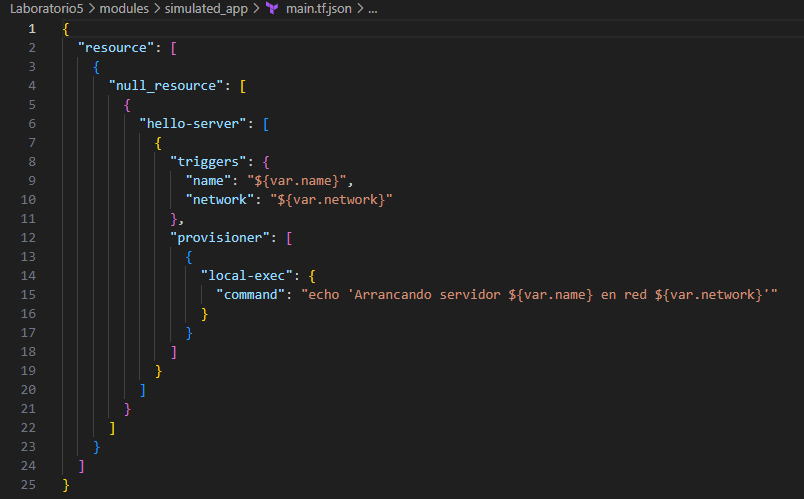

`network.tf.json` define dos variables de Terraform, la varibale name para el servidor y network para la red, con valores por defecto "hello-world" y "local-network" respectivamente.


Ejecutamos el script `generate_envs.py` y se generan 10 entornos en la carpeta environments.
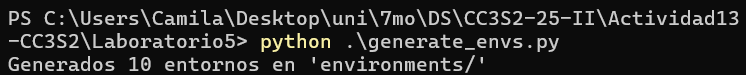

Cada entorno tiene su propia carpeta con los archivos `main.tf.json` y `network.tf.json`.
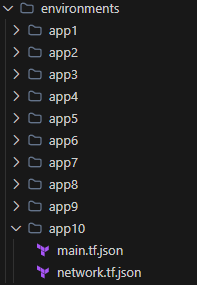

Para el entorno de app1, inicializamos terraform con el comando `terraform init` descargando proveedores necesarios y configurando el backend.
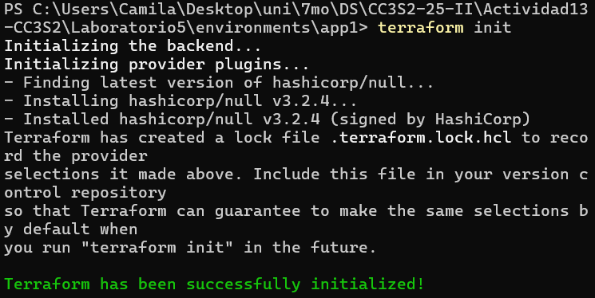

Aplicamos terraform con el comando `terraform apply`.
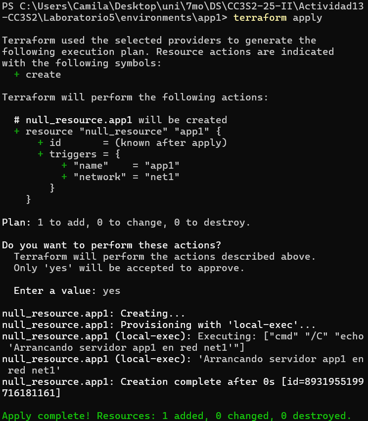
--- 
## Fase 1: Expresando el cambio de infraestructura

Modificamos `modules/simulated_app/network.tf.json` el `default` de `"network"` a `"lab-net"`
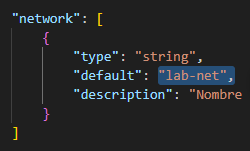

Regeneramos `environments/app1` con `python generate_envs.py`, cuando ejecutamos `terraform plan` en el entorno app1se observa que provoca un cambio únicamente en el atributo network del triggers del recurso `null_resource`

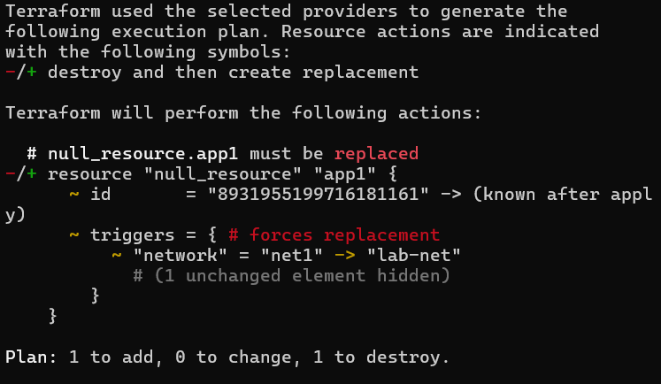

* **Pregunta**

  * ¿Cómo interpreta Terraform el cambio de variable?
  Terraform compara el valor previo del plan almacenado en `terraform.tfstate` con el nuevo valor de la variable, si hay diferencia en un atributo que afecta al recurso, genera un cambio en el plan.

  * ¿Qué diferencia hay entre modificar el JSON vs. parchear directamente el recurso?
  Modificar el JSON cambia la configuración declarativa, mientras que parchear directamente el recurso rompería el control del `terraform.tfstate` y Terraform no tendría forma correcta de detectar ni gestionar los cambios.
  * ¿Por qué Terraform no recrea todo el recurso, sino que aplica el cambio "in-place"?
  Solo reemplaza lo que está afectado por el cambio según las reglas del proveedor, si el atributo no fuerza recreación, Terraform actualiza el recurso sin destruirlo completamente.

  * ¿Qué pasa si editas directamente `main.tf.json` en lugar de la plantilla de variables?
  Si se edita main.tf.json directo, el valor queda hardcodeado en los triggers y Terraform ya no usará la variable ni su default. Eso rompe la parametrización y cualquier cambio futuro se tendrá que aplicar manualmente en cada entorno.

--- 

## Fase 2: Entendiendo la inmutabilidad

#### A. Remediación de 'drift' 
Editamos manualmente main.tf.json, cambiamos `"name":"app2" ->"hacked-app"`
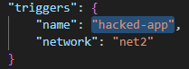

Se muestra un plan que propone revertir ese cambio
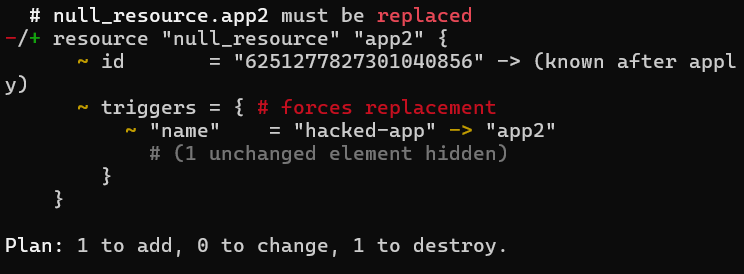

Luego al aplicar `terraform apply`, comprobamos que vuelve a `app2`
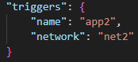

#### B. Migrando a IaC 
* **Mini-reto**
El archivo `legacy/config.cfg` define los parámetros configurables del servicio, el puerto, nombre y nivel de logs.
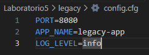

El archivo `legacy/run.sh` inicia el servicio usando esas variables de entorno.
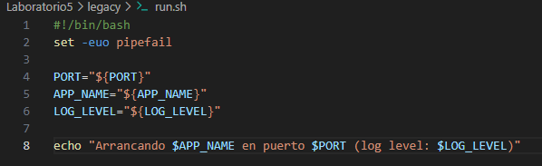

Se creo el archivo `generate_legacy.py` que genera la configuración de Terraform para el servicio legacy, crea los archivos `network.tf.json` y `main.tf.json` en la carpeta `tf_legacy`.

```python
import os, json, hashlib

BASE_DIR = os.path.dirname(os.path.abspath(__file__))
CFG_PATH = os.path.join(BASE_DIR, "config.cfg")
RUN_PATH = os.path.join(BASE_DIR, "run.sh")
OUT_DIR = os.path.join(BASE_DIR, "..", "tf_legacy")

def read_file(path):
    with open(path, "r", encoding="utf-8") as f:
        return f.read()

def parse_cfg(path):
    cfg = {}
    with open(path, "r", encoding="utf-8") as f:
        for line in f:
            line = line.strip()
            if not line or "=" not in line:
                continue
            k, v = line.split("=", 1)
            cfg[k.strip()] = v.strip()
    return cfg

def render_tf_files(cfg, run_script_content):
    os.makedirs(OUT_DIR, exist_ok=True)

    # Crea network.tf.json con variables del config.cfg
    network = {
        "variable": {
            key: {
                "type": "string",
                "default": value
            }
            for key, value in cfg.items()
        }
    }

    with open(os.path.join(OUT_DIR, "network.tf.json"), "w", encoding="utf-8") as f:
        json.dump(network, f, indent=4)

    # Crea main.tf.json con null_resource que usa el run.sh
    script_hash = hashlib.sha256(run_script_content.encode("utf-8")).hexdigest()

    environment = {key: f"${{var.{key}}}" for key in cfg.keys()}

    main = {
        "resource": {
            "null_resource": {
                "legacy_app": {
                    "triggers": {
                        **environment,
                        "script_sha256": script_hash
                    },
                    "provisioner": {
                        "local-exec": {
                            "interpreter": ["/usr/bin/env", "bash", "-c"],
                            "environment": environment,
                            "command": "./legacy/run.sh"
                        }
                    }
                }
            }
        }
    }

    with open(os.path.join(OUT_DIR, "main.tf.json"), "w", encoding="utf-8") as f:
        json.dump(main, f, indent=4)

    print(f"Terraform config generada en '{OUT_DIR}/'")

if __name__ == "__main__":

    cfg = parse_cfg(cfg_path)
    run_script = read_file(run_path)

    render_tf_files(cfg, run_script)
```

Ejecutamos el archivo `generate_legacy.py` y se generan los archivos `network.tf.json` y `main.tf.json` en la carpeta `tf_legacy`.
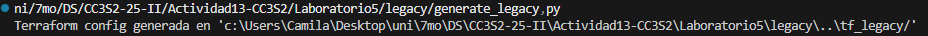
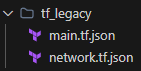

Ejecutamos `terraform init` seguido de `terraform plan` en la carpeta `tf_legacy` y verificamos que el plan coincide con lo declarado en el script `generate_legacy.py`.
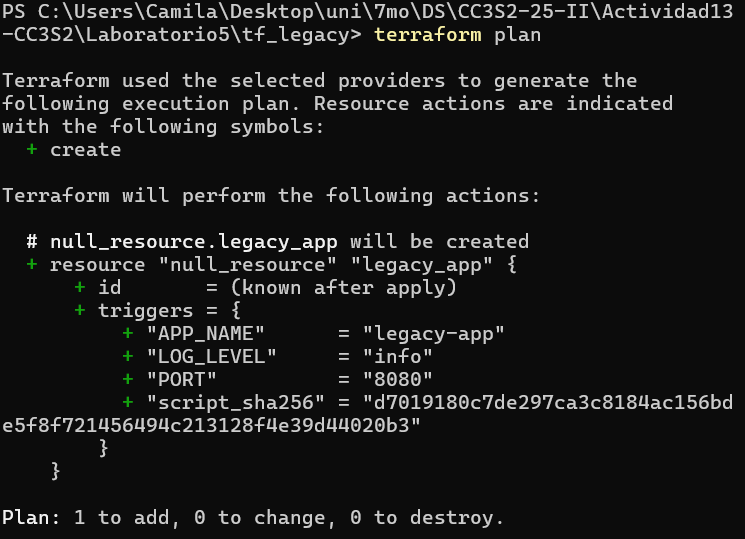

--- 

## Fase 3: Escribiendo código limpio en IaC

### Control de versiones comunica contexto
Cambiamos manualmente el archivo `tf_legacy/network.tf.json` para que el valor por defecto de `APP_NAME` sea `legacy-service`.
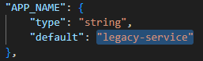

Hacemos un commit con el cambio.
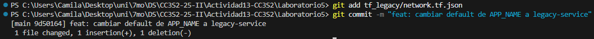

Añadimos una descripción manual al archivo `tf_legacy/main.tf.json`.
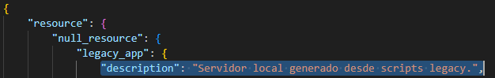

Hacemos un commit con el cambio.
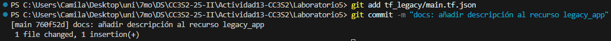

### Linting y formateo
Ejecutamos el siguiente comando y formateamos el archivo `tf_legacy/network.tf.json`.
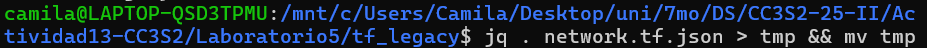

Ahora el archivo `tf_legacy/network.tf.json` se ve así
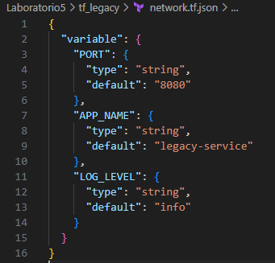

### Nomenclatura de recursos
Renombramos el recurso `null_resource` a `local_server`.
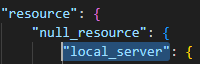

Tambien ajustamos el generador en python
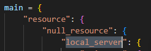

### Variables y constantes
La variable PORT ya se encuentra en el archivo `tf_legacy/network.tf.json`, luego modificamos el archivo `tf_legacy/main.tf.json` para usarla en command directamente


### Parametrizar dependencias
Modificamos el archivo `generate_envs.py` para que genere el entorno `env3` y dependa del entorno `app2`.
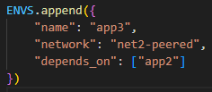
```python
resource_config = {  
        "triggers": {
            "name": env["name"],
            "network": env["network"]
        },
        "provisioner": [{
            "local-exec": {
                "command": f"echo 'Arrancando servidor {env['name']} en red {env['network']}'"
            }
        }]
    }

    config = {
        "resource": [
            {
                "null_resource": [
                    {
                        env["name"]: [resource_config]
                    }
                ]
            }
        ]
    }

    if "depends_on" in env:
        resource_config["depends_on"] = [
            f"null_resource.{dep}" for dep in env["depends_on"]
        ]
```

Ejecutamos el script y tenemos como resultado el entorno `env3` que depende del entorno `app2`.
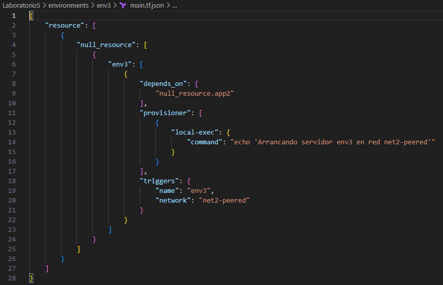

### Mantener en secreto
Marcamos `api_key` como sensitive en el JSON 
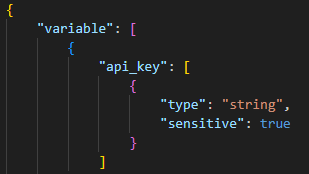

Luego, en el archivo `generate_legacy.py` agregamos la siguiente lógica para obtener el valor de la variable de entorno `API_KEY` y agregarla al diccionario `environment`.

```python
    environment = {key: f"${{var.{key}}}" for key in cfg.keys()}

    api_key = os.environ.get("API_KEY")
    if not api_key:
        print("API_KEY no encontrada en entorno.")

    environment["API_KEY"] = "${var.api_key}"
```
--- 

## Fase 4: Integración final y discusión
1. **Recorrido** por:

   * Detección de drift (*remediation*).
   Probé el drift modificando el entorno manualmente y confirmé que Terraform lo detecta y lo corrige con plan/apply. Esto me permitió entender que el estado es la fuente de verdad y la configuración siempre debe reconciliarse con él.

   * Migración de legacy.
   Tomé el servicio legacy y lo parametrizé leyendo su configuración y script desde Terraform usando local-exec y triggers como script_sha256, logrando que Terraform controle su instalación y cambios sin reescribir el código original.

   * Estructura limpia, módulos, variables sensibles.
   Organicé la infraestructura en módulos y entornos separados, con dependencias depends_on explícitas y manejo seguro de secretos con sensitive=true y variables de entorno. Así mantengo el código más seguro, reutilizable y fácil de extender.

2. **Preguntas abiertas**:

   * ¿Cómo extenderías este patrón para 50 módulos y 100 entornos?
   Yo usaría un solo módulo con for_each, variables externas y estado remoto, o Terragrunt para evitar copiar carpetas. Automatizaría CI/CD para generar y validar los entornos en paralelo sin perder control ni repeti.

   * ¿Qué prácticas de revisión de código aplicarías a los `.tf.json`?
   Siempre pasaría validaciones automáticas, como terraform validate, tflint, tfsec; y exigiría un terraform plan en PRs. Además, nunca editaría los JSON a mano, solo revisaría el origen que los genera.

   * ¿Cómo gestionarías secretos en producción (sin Vault)?
   Cargaría secretos desde variables de entorno o un Secret Manager del cloud y marcaría todo como sensitive, evitando que queden en disco o en el estado. Así nunca van al repo ni se imprimen en logs.

   * ¿Qué workflows de revisión aplicarías a los JSON generados?
   Todo cambio se revisa con plan en PR, y el JSON siempre se regenera de forma automática y determinista en CI. Si el diff no coincide con el generado, se bloquea la fusión para evitar drift humano.