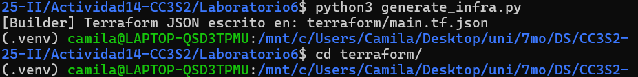
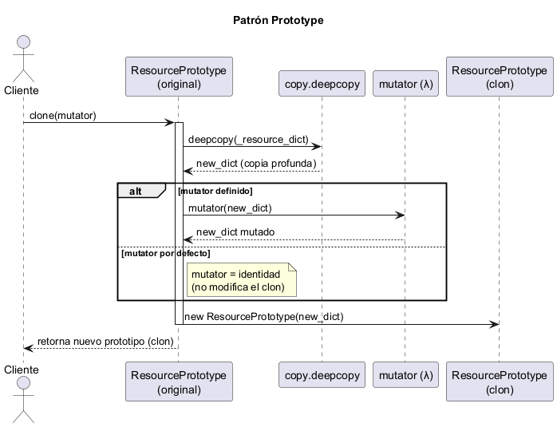

# Actividad 14: Patrones para módulos de infraestructura
**Nombre:** Ariana Camila Lopez Julcarima
**Fecha:** 31/10/2025  
**Tiempo invertido:** 04:00  


---

#### Fase 0: Preparación

Configuré el entorno virtual y genere la infraestructura base ejecutando el script `generate_infra`.


Luego, inicialice terraform ejecutando `terraform init` y valide la sintaxis de los archivos de configuración ejecutando `terraform validate`.


Por último, inspeccione el archivo `terraform/main.tf.json`, se generaron recursos del tipo `null_resource` que dentro de triggers tiene como atributos `factory_uuid`, `timestamp` y `index`.

#### Fase 1: Exploración y análisis

##### 1. Singleton
El archivo correspondiente al patrón singleton es `singleton.py`.

* **Tarea**: Explica cómo `SingletonMeta` garantiza una sola instancia y el rol del `lock`.

`SingletonMeta` es una metaclase que se encarga de controlar la creación de instancias de una clase.

Tiene un diccionario de clase que mantiene un registro de todas las instancias únicas. La clave es la clase misma `type`, y el valor es la instancia única de esa clase. Al ser un atributo de clase, es compartido por todas las instancias de la metaclase.

```python
_instances: Dict[type, "ConfigSingleton"] = {}
```


Luego, con `threading.Lock()` crea un objeto de bloqueo que implementa el protocolo de administración de contexto.

```python
    _lock: threading.Lock = threading.Lock()
```
    
Cuando múltiples hilos intentan crear una instancia simultáneamente, solo uno puede adquirir el bloqueo a la vez. El bloqueo se adquiere al entrar en el bloque `with` y se libera automáticamente al salir. Mientras un hilo mantiene el bloqueo, otros hilos que intenten adquirirlo se bloquearán hasta que se libere. Esto garantiza que solo un hilo pueda ejecutar el código dentro del bloque `with` a la vez.

```python
    def __call__(cls, *args, **kwargs):
        with cls._lock:
            if cls not in cls._instances:
                cls._instances[cls] = super().__call__(*args, **kwargs)
        return cls._instances[cls]
```
Si la instancia no existe, la crea; si ya existe, devuelve la existente.

#### 2. Factory
El archivo correspondiente al patrón factory es `factory.py`.

* **Tarea**: Detalla cómo la fábrica encapsula la creación de `null_resource` y el propósito de sus `triggers`.

El metodo `create` retorna el recurso `null_resource` estructurado como se espera en archivos .tf.json, de esta manera encapsula la creación de un recurso null_resource con triggers personalizados.

```python
# Retorna el recurso estructurado como se espera en archivos .tf.json
        return {
            "resource": [{
                "null_resource": [{
                    name: [{
                        "triggers": triggers
                    }]
                }]
            }]
        }
```

Asegura que siempre haya un diccionario de triggers, además agrega automáticamente factory_uuid y timestamp. 

```python
triggers = triggers or {}

# Agrega un trigger por defecto: UUID aleatorio para asegurar unicidad
triggers.setdefault("factory_uuid", str(uuid.uuid4()))

# Agrega un trigger con timestamp actual en UTC
triggers.setdefault("timestamp", datetime.utcnow().isoformat())
```

El `factory_uuid` es un identificador único que garantiza que cada recurso sea distinto, asegurando la idempotencia, mientras que el `timestamp` proporciona trazabilidad al registrar el momento exacto de creación del recurso.

#### 3. Prototype
El archivo correspondiente al patrón prototype es `prototype.py`.

* **Tarea**: Dibuja un diagrama UML del proceso de clonación profunda y explica cómo el **mutator** permite personalizar cada instancia.

Elaboré un diagrama UML del proceso de clonación profunda, muestra la relación entre 
`ResourcePrototype` y `Client`, donde 
`ResourcePrototype`contiene un diccionario `_resource_dict` y ofrece un método 
`clone(mutator)`
 que crea copias independientes del recurso. El `Client` puede personalizar cada clon mediante la función mutator, que modifica la copia sin afectar al original. La flecha de asociación indica que el cliente interactúa con el prototipo para crear instancias personalizadas.


El método `clone()` crea una copia profunda del diccionario original y luego aplica la función mutator a esta copia, permitiendo modificar directamente (in-place) sin retornar nada. La función mutator es como un molde que personaliza cada instancia clonada según sea necesario. Si no se proporciona un mutator, se usa por defecto lambda d: d, que no realiza cambios, lo que resulta en una copia idéntica al original.

```python
def clone(self, mutator=lambda d: d) -> "ResourcePrototype":

    # Copia profunda para evitar mutaciones al recurso original
    new_dict = copy.deepcopy(self._resource_dict)
    # Aplica la función mutadora para modificar el clon si se desea
    mutator(new_dict)
    # Devuelve un nuevo prototipo con el contenido clonado
    return ResourcePrototype(new_dict)
```

#### 4. Composite
El archivo correspondiente al patrón composite es `composite.py`.

* **Tarea**: Describe cómo `CompositeModule` agrupa múltiples bloques en un solo JSON válido para Terraform.

La clase `CompositeModule` agrupa múltiples recursos Terraform en una sola estructura JSON válida, utiliza una lista interna _children para almacenar los recursos, que se pueden agregar mediante el método `add()`. Al exportar con `export()`, combina todos los recursos en un solo diccionario bajo la clave resource, lo que permite generar un archivo de configuración de Terraform completo.

```python
def export(self) -> Dict[str, Any]:

        aggregated: Dict[str, Any] = {"resource": []}
        for child in self._children:
            # Combina ordenadamente todos los bloques 'resource' de los hijos
            # diccionario {"resource":[...]}
            aggregated["resource"].extend(child.get("resource", []))
        return aggregated
```
#### 5. Builder
El archivo correspondiente al patrón builder es `builder.py`.

* **Tarea**: Explica cómo `InfrastructureBuilder` orquesta Factory -> Prototype -> Composite y genera el archivo JSON final.