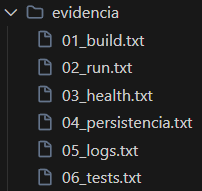

### Actividad 19: Arquitectura y desarrollo de microservicios con Docker y Kubernetes

**Nombre:** Ariana Camila Lopez Julcarima

**Fecha:** 24/11/2025  

### Conceptualización de microservicios

**Ejercicio**: Explica la evolución: Monolito -> SOA -> Microservicios.

**Respuesta:**  
* Monolito: Toda la lógica vive en un solo proyecto y se despliega como una única aplicación. Es simple al inicio pero con el tiempo el código crece, se vuelve difícil de cambiar y cualquier despliegue afecta a todo el sistema.

* SOA (Service Oriented Architecture): La aplicación se divide en servicios más grandes que se comunican entre sí mediante un canal común de integración. Reduce algo de acoplamiento pero muchos servicios siguen siendo pesados y muy ligados a la infraestructura.

* Microservicios: La aplicación se divide en servicios pequeños y autónomos. Cada servicio se enfoca en una capacidad de negocio clara, expone una API y se puede desplegar y escalar de forma independiente.

**Ejercicio**: Presenta 2 casos donde el monolito se vuelve costoso de operar.

**Respuesta:**  

* E-commerce con picos estacionales: En campañas como Black Friday la carga de un E-commerce se concentra en catálogo y pagos. Con un monolito se debe escalar toda la aplicación aunque solo unas partes reciban tráfico intenso. Esto aumenta el costo de infraestructura y el riesgo de que un cambio en una zona poco usada afecte todo el sistema en el momento crítico.

* Plataforma SaaS multi tenant: En un SaaS que da servicio a muchas empresas, módulos como usuarios facturación reportes y notificaciones evolucionan a ritmos distintos. En un monolito todos dependen del mismo despliegue. Un fallo en reportes puede bloquear una mejora urgente en facturación y no es posible escalar solo el módulo con más carga. Con microservicios cada capacidad de negocio puede cambiarse y escalarse por separado.

#### Popularidad y beneficios de los microservicios

**Ejercicio:**  Cita por qué empresas grandes los adoptaron

**Respuesta:**  
Grandes empresas como Netflix, Amazon o Uber adoptaron microservicios para manejar el crecimiento y la complejidad porque permiten aislar fallos, de forma que si el servicio de recomendaciones se cae no deja de funcionar el proceso de compra, además facilitan escalar solo las partes críticas como pagos o búsqueda, dan más autonomía a los equipos ya que cada uno puede desarrollar y operar su propio servicio con la tecnología y el ritmo de despliegue que prefiera, y mejoran la integración y entrega continua al tener canales de despliegue por servicio con cambios más pequeños y frecuentes.

#### Desventajas y retos de microservicios

**Ejercicio:** Menciona 4 desafíos: redes/seguridad, orquestación, consistencia de datos, testing distribuido.

**Respuesta:**  
* Redes y seguridad: La comunicación entre los servicios y la seguridad de estos se vuelve mas compleja porque hay más llamadas remotas, más puntos de fallo y una superficie de ataque mayor, por lo que se necesitan políticas de red de tipo zero trust, autenticación entre servicios, uso de cifrado TLS en la comunicación interna y mallas de servicio para controlar y proteger el tráfico.

* Orquestación: La orquestación se vuelve necesaria cuando hay que manejar varios servicios, lo que exige una plataforma como Kubernetes y se mitiga al estandarizar despliegues con contenedores, archivos de configuración bien definidos y herramientas como Helm para gestionar plantillas y configuraciones.

* Consistencia de datos: Se complica porque cada servicio mantiene su propia base de datos y las transacciones que cruzan varios servicios son difíciles de manejar, por lo que se recurre a uso de eventos de dominio, aceptación de consistencia eventual y un diseño cuidadoso de los límites de datos entre servicios.

* Testing distribuido: Las pruebas distribuidas son más difíciles porque los flujos de principio a fin pasan por muchos servicios distintos, por lo que ayuda tener contratos de API bien definidos con esquemas compartidos, pruebas contractuales entre consumidores y productores de servicios y herramientas de trazabilidad como Jaeger para seguir una petición a lo largo de todo el recorrido.

**Ejercicio:** Mitigaciones: OpenAPI/contratos, pruebas contractuales, trazabilidad (Jaeger), patrones de sagas.

**Respuesta:**  

Como forma de mitigación podemos definir las APIs mediante contratos claros usando OpenAPI, complementar eso con pruebas contractuales entre consumidores y proveedores para detectar incompatibilidades antes de llegar a producción, añadir trazabilidad distribuida con herramientas como Jaeger para seguir una petición a través de varios servicios e identificar rápidamente dónde falla, y aplicar patrones de sagas para coordinar operaciones que involucran varias bases de datos, manejando errores con pasos compensatorios y aceptando consistencia eventual cuando sea necesario.

#### Principios de diseño

**Ejercicio:**  Ejemplo de decisiones de diseño.

**Respuesta:**
* DDD: Defino los servicios según límites contextuales de DDD, separando Catálogo, Carrito, Pedidos y Pagos como servicios independientes, cada uno con su propia capacidad de negocio.

* DRY vs duplicación: Para evitar acoplamiento fuerte, se acepta duplicación controlada de algunos modelos, por ejemplo, un ProductSummary en Catálogo y en Carrito, en lugar de una librería compartida gigante.

* Tamaño de los servicios: Cada servicio agrupa una capacidad de negocio completa en vez de seguir reglas rígidas como “una tabla por servicio”; por ejemplo, Pagos incluye toda la lógica de cobro, integración con pasarelas y gestión de estados de pago aunque use varias tablas.

### Empaquetado y verificación con Docker 

**Ejercicio:** Evidencias en texto plano de: `build`, `run`, `curl`, `logs` y `pytest -q`.

**Respuesta:**
Las evidencias de ejecución se guardaron en archivos de texto plano dentro de la carpeta evidencias.

**Ejercicio:** Breve explicación de por qué no se usa `latest` y cómo SemVer garantiza reproducibilidad.

**Respuesta:**

No se usa la etiqueta latest porque es ambigua y puede apuntar a una versión distinta sin avisar, lo que rompe despliegues que antes funcionaban y hace difícil saber qué versión exacta está corriendo en cada entorno. En cambio SemVer usa un esquema de versión con tres números por ejemplo 0.1.0 que representan cambios mayores menores y de corrección y cada imagen se construye y se etiqueta con un número concreto, de modo que siempre se puede volver a usar la misma versión, reproducir el mismo comportamiento en distintos ambientes y controlar cuándo se actualiza a una versión compatible o a una versión que introduce cambios más grandes.

### Desarrollo y despliegue (Compose/K8s)

**Ejercicios (redacción)**

**Respuestas:**

1. **Tres escenarios donde Compose mejora el flujo diario**:
   - **Staging local**: En un entorno de staging local se busca algo parecido a producción pero en la propia máquina. Docker compose ayuda porque permite definir en un solo archivo el servicio de la api, la base de datos y la cache, todos conectados en la misma red. Luego con un solo comando se levantan juntos siempre de la misma forma, lo que hace más fácil reproducir errores y validar cambios antes de pasar a un entorno real.
   - **Pruebas de integración**: Para pruebas de integración es común necesitar dependencias reales como una base de datos. Sin compose habría que crear cada contenedor a mano y recordar todos los parámetros. Con compose se definen esos servicios una sola vez en el archivo y luego se levanta el entorno completo siempre igual, lo que hace que las pruebas sean más confiables y fáciles de automatizar en un pipeline.

   - **Recarga en vivo**: Durante el desarrollo se cambian archivos con mucha frecuencia. Compose permite montar el código fuente del proyecto dentro del contenedor mediante un bind mount y ejecutar el servidor con recarga automática usando uvicorn con la opción de recargar. Así cada vez que se guarda un cambio la aplicación se reinicia sola dentro del contenedor sin volver a construir la imagen, lo que acelera mucho el ciclo probar cambiar probar.

2. **Por qué usar perfiles**: Los perfiles permiten definir configuraciones distintas para cada tipo de entorno así se puede tener un perfil de desarrollo con recarga automática volúmenes montados y herramientas de debug y otro perfil de pruebas con imágenes limpias sin montajes del código y sin servicios innecesarios esto evita levantar contenedores que no se necesitan en cierto momento y hace que los comandos sean más claros por ejemplo se puede ejecutar solo lo definido para pruebas con un perfil específico sin tocar lo que se usa en desarrollo diario.

3. **Fragmento conceptual de `docker-compose.yml`**: El archivo docker compose podría tener un servicio llamado api que usa una imagen personalizada del microservicio y publica el puerto interno ochenta hacia el puerto ochenta ochenta del host usando una referencia tipo `8080:80`. Este servicio montaría el código fuente local dentro del contenedor mediante un bind mount del estilo `./app:/app` para permitir recarga en vivo y ejecutaría un comando basado en uvicorn con `--reload` para reiniciar la aplicación cada vez que cambie el código. Además habría un servicio de cache como redis usando una imagen oficial que expone su puerto interno seiscientos treinta y siete nueve solo dentro de la red interna definida por compose. Finalmente el servicio api incluiría una referencia `depends_on: [cache]` para indicar que debe iniciar después del servicio de cache, garantizando que la conexión esté disponible cuando la api arranque.

