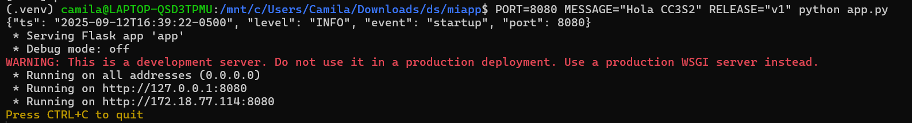
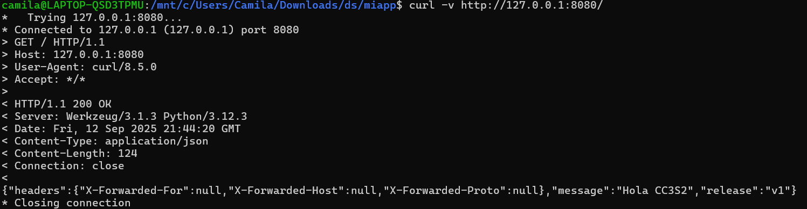
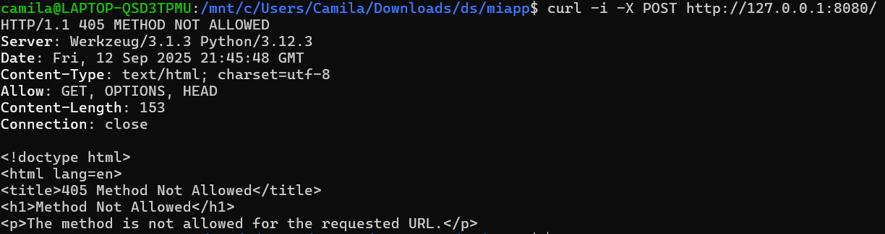

### Actividades y evidencias

#### 1) HTTP: Fundamentos y herramientas

**Meta:** ver anatomía petición/respuesta, métodos y códigos.

1. **Levanta la app** con variables de entorno (12-Factor):
   `PORT=8080 MESSAGE="Hola CC3S2" RELEASE="v1" python3 app.py` (usa tu *venv*). La app **escucha** en el puerto indicado y **loggea en stdout**. Incluye extracto de salida (stdout) en el reporte.
   
3. **Inspección con `curl`:**

   * `curl -v http://127.0.0.1:8080/` (cabeceras, código de estado, cuerpo JSON).
   
   * `curl -i -X POST http://127.0.0.1:8080/` (explica qué ocurre si no hay ruta/método).
   
   * **Pregunta guía:** ¿Qué campos de respuesta cambian si actualizas `MESSAGE`/`RELEASE` sin reiniciar el proceso? Explica por qué.
   }Si actualizo las variables de entorno MESSAGE y RELEASE sin reiniciar el proceso de la aplicación, los campos correspondientes en la respuesta JSON, como message y release, no cambiarán, ya que las variables de entorno son leídas solo al inicio del proceso y no se actualizan durante su ejecución. Esto se debe al principio de 12-Factor, que establece que las configuraciones de una aplicación deben ser proporcionadas al inicio del proceso a través de variables de entorno y no deben modificarse dinámicamente mientras el proceso está en ejecución. Para que los nuevos valores de estas variables se reflejen en la respuesta, es necesario reiniciar la aplicación, ya que al hacerlo se leen nuevamente las variables de entorno con sus nuevos valores.

