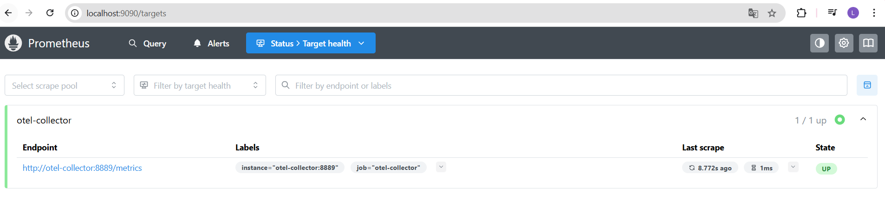
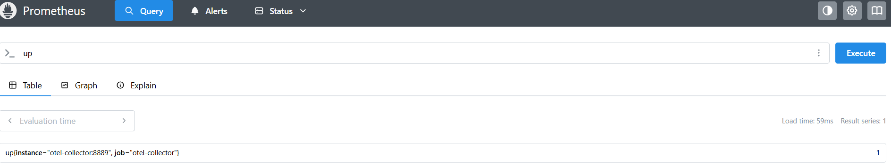
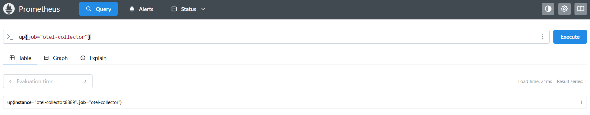

#### Tarea B1 - Verificar targets


El target es el sevicio `otel-collector `  que está siendo monitoreado por Prometheus.
Endpoint: http://otel-collector:8889/metrics
Estado actual: UP (activo)
Último scrape: Hace 8.772 segundos
Duración del scrape: 0.002s
Etiquetas:
instance="otel-collector:8889"
job="otel-collector"
Explicación de las etiquetas
job="otel-collector"
Qué es: En Prometheus, un job es un grupo de instancias que comparten el mismo propósito.
Significado: Indica que este es un trabajo de recolección de métricas del OpenTelemetry Collector.
Uso: Agrupa todas las instancias relacionadas con la recolección de métricas del OpenTelemetry.
instance="otel-collector:8889"
Qué es: Identifica una instancia específica dentro de un job.
Significado:
otel-collector: Nombre del servicio/host
8889: Puerto donde el servicio expone sus métricas
Uso: Permite identificar la ubicación exacta del servicio que está siendo monitoreado.
En resumen, esta configuración muestra que Prometheus está correctamente configurado para rastrear las métricas del OpenTelemetry Collector, que es un componente clave en tu stack de observabilidad para recolectar, procesar y exportar métricas, logs y trazas.

#### Tarea B2 - Consultas PromQL básicas

En la pestaña **Query** de Prometheus:

1. Ejecuta:

   ```promql
   up
   ```



2. Ejecuta:

   ```promql
   up{job="otel-collector"}
   ```


3. Explora métricas que empiecen por `http`:

   * Escribe `http` en el autocompletado de métricas.
   * Elige alguna que tenga datos (por ejemplo `http_server_requests_total` o similar).
   * Ejecuta la consulta sin filtros.
   * Luego añade filtros por labels (por ejemplo `service_name="demo-app"` si existe).

En `metrics-prometheus.md`:

* Copia las expresiones PromQL usadas.
* Explica qué tipo de métrica es (counter, gauge, histogram…) y qué representa.
