**Nombre:** Ariana Camila Lopez Julcarima
**Fecha:** 24/09/2025  
**Tiempo invertido:** 04:00  

**Entorno utilizado:**  
Laptop personal con navegador Chrome y sistema operativo Windows 11.

---

#### Ejercicios

1. Ejecuta `make help` y guarda la salida para análisis. Luego inspecciona `.DEFAULT_GOAL` y `.PHONY` dentro del Makefile.
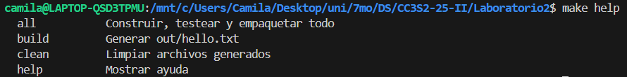
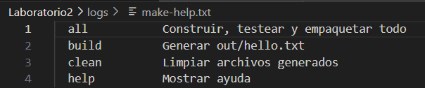


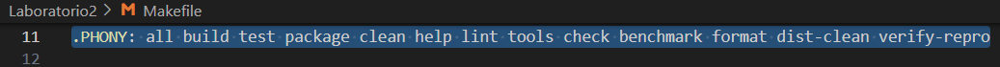

   Entrega: redacta 5-8 líneas explicando qué imprime `help`, por qué `.DEFAULT_GOAL := help` muestra ayuda al correr `make` sin argumentos, y la utilidad de declarar PHONY.

2. Comprueba la generación e idempotencia de `build`. Limpia salidas previas, ejecuta `build`, verifica el contenido y repite `build` para constatar que no rehace nada si no cambió la fuente.
   Comandos:

   ```bash
   rm -rf out dist
   make build | tee logs/build-run1.txt
   cat out/hello.txt | tee evidencia/out-hello-run1.txt
   make build | tee logs/build-run2.txt
   stat -c '%y %n' out/hello.txt | tee -a logs/build-run2.txt
   ```
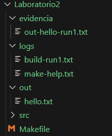
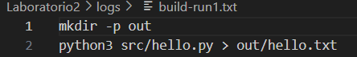

   Entrega: explica en 4-6 líneas la diferencia entre la primera y la segunda corrida, relacionándolo con el grafo de dependencias y marcas de tiempo.

3. Fuerza un fallo controlado para observar el modo estricto del shell y `.DELETE_ON_ERROR`. Sobrescribe `PYTHON` con un intérprete inexistente y verifica que no quede artefacto corrupto.


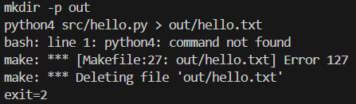
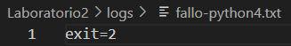
   Entrega: en 5-7 líneas, comenta cómo `-e -u -o pipefail` y `.DELETE_ON_ERROR` evitan estados inconsistentes.

4. Realiza un "ensayo" (dry-run) y una depuración detallada para observar el razonamiento de Make al decidir si rehacer o no.
   Comandos:

   ```bash
   make -n build | tee logs/dry-run-build.txt
   make -d build |& tee logs/make-d.txt
   grep -n "Considerando el archivo objetivo 'out/hello.txt'" logs/make-d.txt
   ```
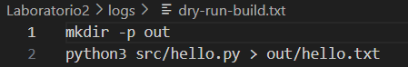
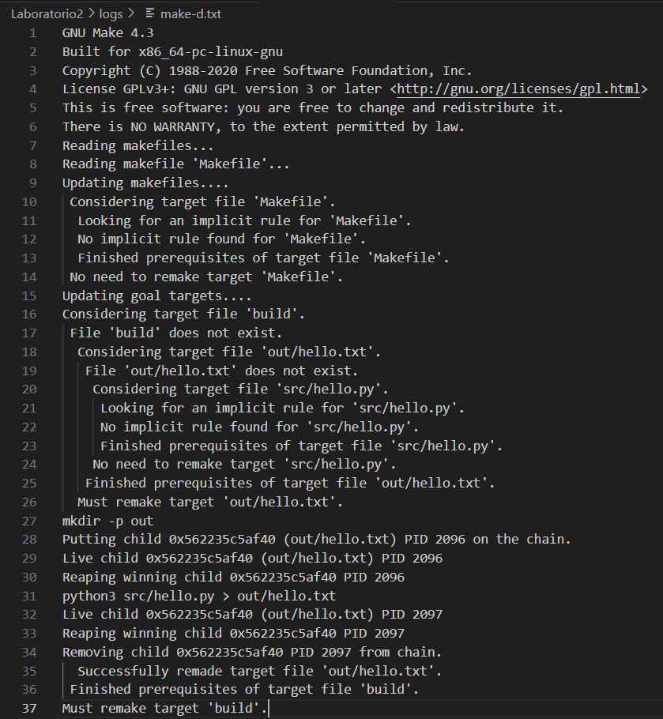
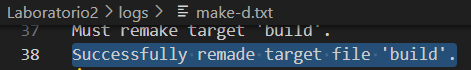
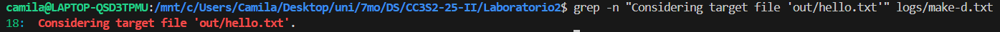
   Entrega: resume en 6-8 líneas qué significan fragmentos resultantes.

5. Demuestra la incrementalidad con marcas de tiempo. Primero toca la **fuente** y luego el **target** para comparar comportamientos.
   Comandos:

   ```bash
   touch src/hello.py
   make build | tee logs/rebuild-after-touch-src.txt

   touch out/hello.txt
   make build | tee logs/no-rebuild-after-touch-out.txt
   ```
   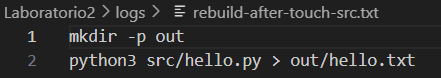
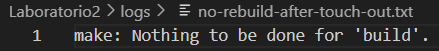
   Entrega: explica en 5-7 líneas por qué cambiar la fuente obliga a rehacer, mientras que tocar el target no forja trabajo extra.

6. Ejecuta verificación de estilo/formato **manual** (sin objetivos `lint/tools`). Si las herramientas están instaladas, muestra sus diagnósticos; si no, deja evidencia de su ausencia.
   Comandos:
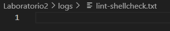
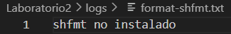
   ```bash
   sudo apt update
   sudo apt install -y golang-go
   go install mvdan.cc/sh/v3/cmd/shfmt@latest
   sudo mv ~/go/bin/shfmt /usr/local/bin/
   shfmt --version
   ```
   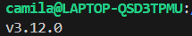

   Entrega: en 4-6 líneas, interpreta advertencias/sugerencias (o comenta la ausencia de herramientas y cómo instalarlas en tu entorno).

7. Construye un paquete **reproducible** de forma manual, fijando metadatos para que el hash no cambie entre corridas idénticas. Repite el empaquetado y compara hashes.
   Comandos:

   ```bash
   mkdir -p dist
   tar --sort=name --mtime='@0' --owner=0 --group=0 --numeric-owner -cf dist/app.tar src/hello.py
   gzip -n -9 -c dist/app.tar > dist/app.tar.gz
   sha256sum dist/app.tar.gz | tee logs/sha256-1.txt

   rm -f dist/app.tar.gz
   tar --sort=name --mtime='@0' --owner=0 --group=0 --numeric-owner -cf dist/app.tar src/hello.py
   gzip -n -9 -c dist/app.tar > dist/app.tar.gz
   sha256sum dist/app.tar.gz | tee logs/sha256-2.txt

   diff -u logs/sha256-1.txt logs/sha256-2.txt | tee logs/sha256-diff.txt || true
   ```
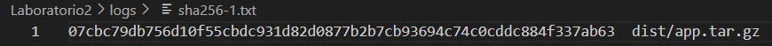
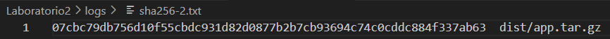
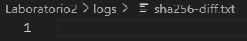
   Entrega: pega el hash y explica en 5-7 líneas cómo `--sort=name`, `--mtime=@0`, `--numeric-owner` y `gzip -n` eliminan variabilidad.

8. Reproduce el error clásico "missing separator" **sin tocar el Makefile original**. Crea una copia, cambia el TAB inicial de una receta por espacios, y confirma el error.
   Comandos:

   ```bash
   cp Makefile Makefile_bad
   # (Edita Makefile_bad: en la línea de la receta de out/hello.txt, reemplaza el TAB inicial por espacios)
   make -f Makefile_bad build |& tee evidencia/missing-separator.txt || echo "error reproducido (correcto)"
   ```
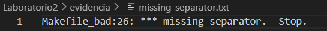
   Entrega: explica en 4-6 líneas por qué Make exige TAB al inicio de líneas de receta y cómo diagnosticarlo rápido.

#### 1.3 Crear un script Bash 

Haz ejecutable y pega el contenido:


**Ejercicios:**

* Ejecuta ./scripts/run\_tests.sh en un repositorio limpio. Observa las líneas "Demostrando pipefail": primero sin y luego con pipefail.
  Verifica que imprime "Test pasó" y termina exitosamente con código 0 (`echo $?`).
  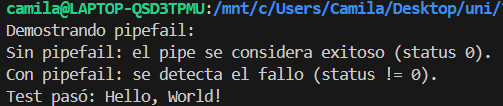
* Edita src/hello.py para que no imprima "Hello, World!". Ejecuta el script: verás "Test falló", moverá hello.py a hello.py.bak, y el **trap** lo restaurará. Confirma código 2 y ausencia de .bak.
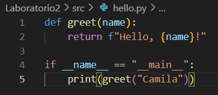
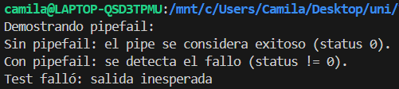
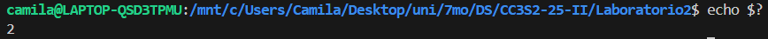
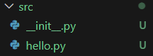

* Ejecuta `bash -x scripts/run_tests.sh`. Revisa el trace: expansión de `tmp` y `PY`, llamadas a funciones, here-doc y tuberías. Observa el trap armado al inicio y ejecutándose al final; estado 0.
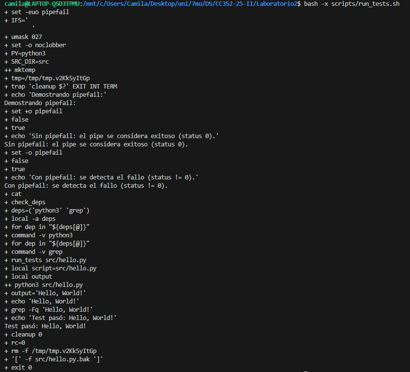
* Sustituye `output=$("$PY" "$script")` por `("$PY" "$script")`. Ejecuta script. `output` queda indefinida; con `set -u`, al referenciarla en `echo` aborta antes de `grep`. El trap limpia y devuelve código distinto no-cero.
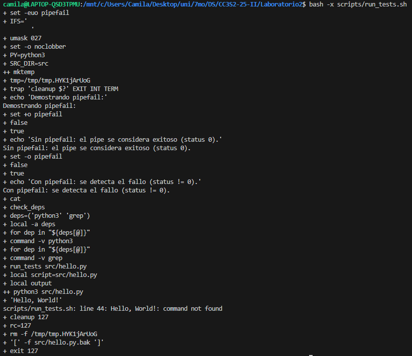
 > En Bash, *trap* registra acciones a ejecutar cuando ocurren señales o eventos (EXIT, INT, ERR).
> Permite limpiar recursos, restaurar archivos, cerrar procesos, registrar errores y preservar códigos de salida correctamente.

### Parte 2: Leer - Analizar un repositorio completo

> Para esta sección de la actividad utiliza de referencia el laboratorio 2 del curso entregado [aquí](https://github.com/kapumota/Curso-CC3S2/tree/main/labs/Laboratorio2).

#### 2.1 Test de ejemplo

`tests/test_hello.py`:

```python
import unittest
from src.hello import greet

class TestGreet(unittest.TestCase):
    def test_greet(self):
        self.assertEqual(greet("Paulette"), "Hello, Paulette!")

if __name__ == "__main__":
    unittest.main()
```

> `python -m unittest` corre desde la raíz; `src/__init__.py` permite `from src.hello import greet`.

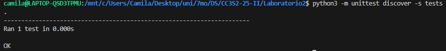
#### Makefile completo (con reproducibilidad y utilidades)

```makefile
SHELL := bash
.SHELLFLAGS := -eu -o pipefail -c
MAKEFLAGS += --warn-undefined-variables --no-builtin-rules
.DELETE_ON_ERROR:
.DEFAULT_GOAL := help
export LC_ALL := C
export LANG   := C
export TZ     := UTC

.PHONY: all build test package clean help lint tools check benchmark format dist-clean verify-repro

PYTHON ?= python3
SHELLCHECK := shellcheck
SHFMT := shfmt
SRC_DIR := src
TEST_DIR := tests
OUT_DIR := out
DIST_DIR := dist

all: tools lint build test package ## Construir, testear y empaquetar todo

build: $(OUT_DIR)/hello.txt ## Generar out/hello.txt

$(OUT_DIR)/hello.txt: $(SRC_DIR)/hello.py
	mkdir -p $(@D)
	$(PYTHON) $< > $@

test: $(SRC_DIR)/hello.py $(TEST_DIR)/test_hello.py scripts/run_tests.sh ## Ejecutar tests
	scripts/run_tests.sh
	$(PYTHON) -m unittest discover -s $(TEST_DIR) -v

package: $(DIST_DIR)/app.tar.gz ## Crear dist/app.tar.gz

$(DIST_DIR)/app.tar.gz: $(OUT_DIR)/hello.txt
	mkdir -p $(@D)
	tar --sort=name --owner=0 --group=0 --numeric-owner --mtime='UTC 1970-01-01' -czf $@ -C $(OUT_DIR) hello.txt

lint: ## Lint Bash y (opcional) Python
	$(SHELLCHECK) scripts/run_tests.sh
	$(SHFMT) -d scripts/run_tests.sh
	@command -v ruff >/dev/null 2>&1 && ruff check $(SRC_DIR) || echo "ruff no instalado; omitiendo lint Python"

tools: ## Verificar dependencias
	@command -v $(PYTHON) >/dev/null || { echo "Falta $(PYTHON)"; exit 1; }
	@command -v $(SHELLCHECK) >/dev/null || { echo "Falta shellcheck"; exit 1; }
	@command -v $(SHFMT) >/dev/null || { echo "Falta shfmt"; exit 1; }
	@command -v grep >/dev/null || { echo "Falta grep"; exit 1; }
	@command -v awk >/dev/null || { echo "Falta awk"; exit 1; }
	@command -v tar >/dev/null || { echo "Falta tar"; exit 1; }
	@tar --version 2>/dev/null | grep -q 'GNU tar' || { echo "Se requiere GNU tar"; exit 1; }
	@command -v sha256sum >/dev/null || { echo "Falta sha256sum"; exit 1; }

check: lint test ## Ejecutar lint y tests

benchmark: | $(OUT_DIR) ## Medir tiempo de ejecución
	@mkdir -p $(OUT_DIR)
	@echo "Benchmark: $(shell date '+%Y-%m-%d %H:%M:%S') / Commit: $(shell git rev-parse --short HEAD 2>/dev/null || echo 'N/A')" > $(OUT_DIR)/benchmark.txt
	@if command -v /usr/bin/time >/dev/null 2>&1; then \
	  /usr/bin/time -f "Tiempo: %E" make all >> $(OUT_DIR)/benchmark.txt 2>&1; \
	else \
	  time -p make all >> $(OUT_DIR)/benchmark.txt 2>&1; \
	fi

format: ## Formatear scripts con shfmt
	$(SHFMT) -w scripts/run_tests.sh

dist-clean: clean ## Limpiar todo (incluye caches opcionales)
	@find . -type d -name '__pycache__' -prune -exec rm -rf {} +
	@rm -rf .ruff_cache

verify-repro: ## Verificar que dist/app.tar.gz sea 100% reproducible
	@rm -rf $(OUT_DIR) $(DIST_DIR); $(MAKE) -s package
	@cp $(DIST_DIR)/app.tar.gz app1.tar.gz
	@rm -rf $(OUT_DIR) $(DIST_DIR); $(MAKE) -s package
	@cp $(DIST_DIR)/app.tar.gz app2.tar.gz
	@h1=$$(sha256sum app1.tar.gz | awk '{print $$1}'); \
	  h2=$$(sha256sum app2.tar.gz | awk '{print $$1}'); \
	  echo "SHA256_1=$$h1"; echo "SHA256_2=$$h2"; \
	  test "$$h1" = "$$h2" && echo "OK: reproducible" || { echo "ERROR: no reproducible"; exit 1; }
	@rm -f app1.tar.gz app2.tar.gz


clean: ## Limpiar archivos generados
	rm -rf $(OUT_DIR) $(DIST_DIR)

help: ## Mostrar ayuda
	@grep -E '^[a-zA-Z0-9_-]+:.*?## ' $(MAKEFILE_LIST) | awk -F':|##' '{printf "  %-12s %s\n", $$1, $$3}'
```

**Ejercicios:**
* Ejecuta `make -n all` para un dry-run que muestre comandos sin ejecutarlos; identifica expansiones `$@` y `$<`, el orden de objetivos y cómo `all` encadena `tools`, `lint`, `build`, `test`, `package`.
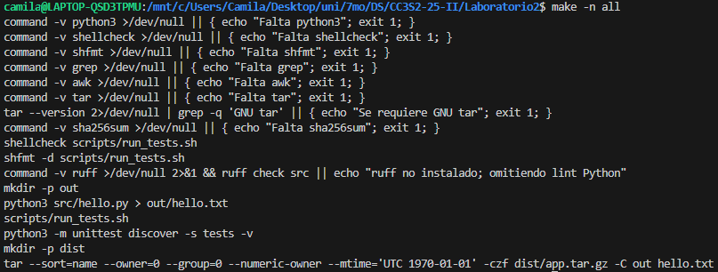
* Ejecuta `make -d build` y localiza líneas "Considerando el archivo objetivo" y "Debe deshacerse",  explica por qué recompila o no `out/hello.txt` usando marcas de tiempo y cómo `mkdir -p $(@D)` garantiza el directorio.
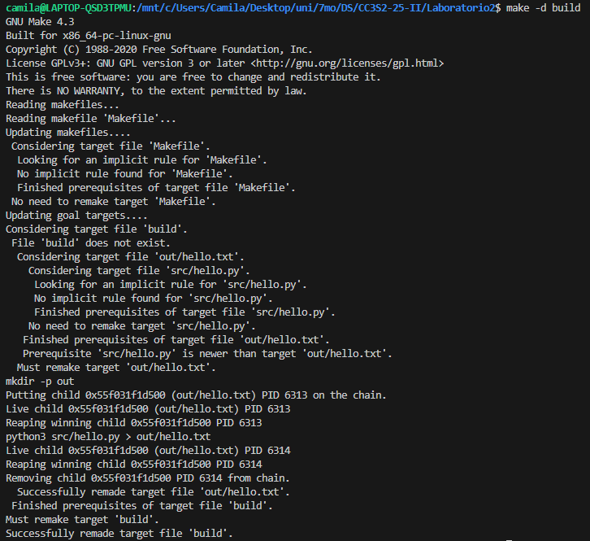
* Fuerza un entorno con BSD tar en PATH y corre `make tools`; comprueba el fallo con "Se requiere GNU tar" y razona por qué `--sort`, `--numeric-owner` y `--mtime` son imprescindibles para reproducibilidad determinista.
* Ejecuta `make verify-repro`; observa que genera dos artefactos y compara `SHA256_1` y `SHA256_2`. Si difieren, hipótesis: zona horaria, versión de tar, contenido no determinista o variables de entorno no fijadas.
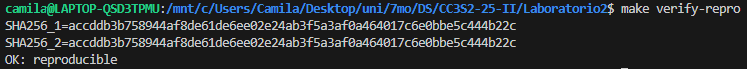
* Corre `make clean && make all`, cronometrando; repite `make all` sin cambios y compara tiempos y logs. Explica por qué la segunda es más rápida gracias a timestamps y relaciones de dependencia bien declaradas.
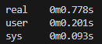
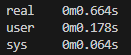
* Ejecuta `PYTHON=python3.12 make test` (si existe). Verifica con `python3.12 --version` y mensajes que el override funciona gracias a `?=` y a `PY="${PYTHON:-python3}"` en el script; confirma que el artefacto final no cambia respecto al intérprete por defecto.
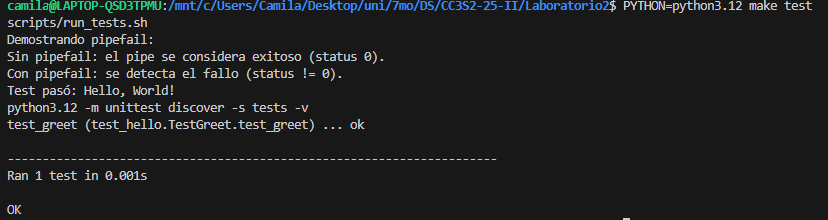
* Ejecuta `make test`; describe cómo primero corre `scripts/run_tests.sh` y luego `python -m unittest`. Determina el comportamiento si el script de pruebas falla y cómo se propaga el error a la tarea global.
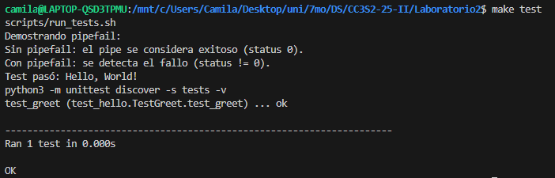
* Ejecuta `touch src/hello.py` y luego `make all`; identifica qué objetivos se rehacen (`build`, `test`, `package`) y relaciona el comportamiento con el timestamp actualizado y la cadena de dependencias especificada.
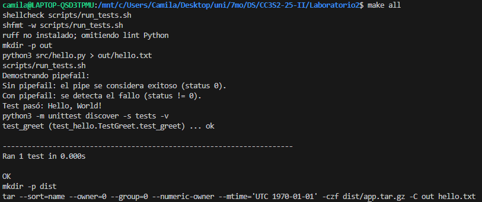
* Ejecuta `make -j4 all` y observa ejecución concurrente de objetivos independientes; confirma resultados idénticos a modo secuencial y explica cómo `mkdir -p $(@D)` y dependencias precisas evitan condiciones de carrera.
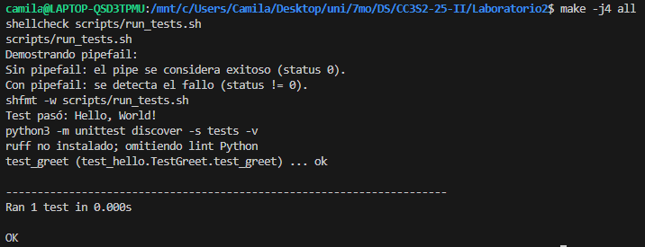
* Ejecuta `make lint` y luego `make format`; interpreta diagnósticos de `shellcheck`, revisa diferencias aplicadas por `shfmt` y, si está disponible, considera la salida de `ruff` sobre `src/` antes de empaquetar.
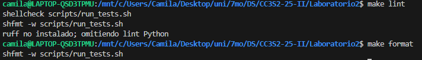

### Parte 3: Extender

#### 3.1 `lint` mejorado

Rompe a propósito un *quoting* en `scripts/run_tests.sh` (por ejemplo, quita comillas a una variable que pueda contener espacios) y ejecuta `make lint`. `shellcheck` debe reportar el problema; corrígelo y vuelve a correr.
Luego ejecuta `make format` para aplicar `shfmt` y estandarizar estilo. Si tienes `ruff`, inspecciona Python y corrige advertencias.
*(Nota: si `ruff` no está instalado, el Makefile ya lo trata como opcional y no debe romper la build.)*

```bash
make lint
make format
ruff check src || true
```
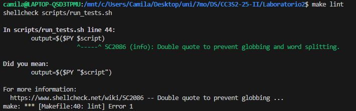
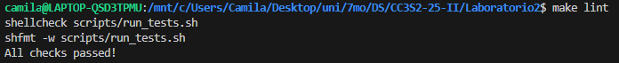
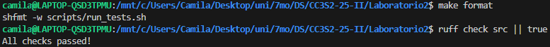

#### 3.2 Rollback adicional

Este chequeo asegura que, si el temporal desaparece, el script falla limpiamente y el `trap` revierte el estado (restaura `hello.py` desde `.bak`) preservando el código de salida.
Borra el archivo temporal manualmente y observa el comportamiento: mensaje claro, salida no-cero, restauración y limpieza.
*(Sugerencia práctica para reproducir la condición sin ambigüedad: opcionalmente imprime la ruta del temporal y da una pequeña pausa antes del chequeo para poder borrarlo desde otra terminal, por ejemplo, añadir `echo "$tmp" > out/tmp_path.txt; sleep 3` justo antes del `if`.)*
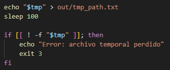
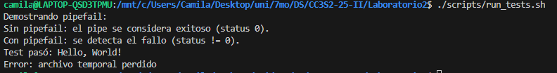
```bash
# Al final de run_tests (sin cambiar nada más)
if [[ ! -f "$tmp" ]]; then
    echo "Error: archivo temporal perdido"
    exit 3
fi
```

```bash
# Prueba
./scripts/run_tests.sh
# (opcional) En otra terminal, borra el tmp antes del check:
# rm -f "$(cat out/tmp_path.txt)"
```

#### 3.3 Incrementalidad

Ejecuta dos veces `make benchmark` para comparar un build limpio frente a uno cacheado; revisa `out/benchmark.txt`. Después, modifica el *timestamp* del origen con `touch src/hello.py` y repite. Observa que `build`, `test` y `package` se rehacen.
Interpreta tiempos y relación con dependencias y marcas de tiempo.

```bash
make benchmark
make benchmark
touch src/hello.py
make benchmark
```
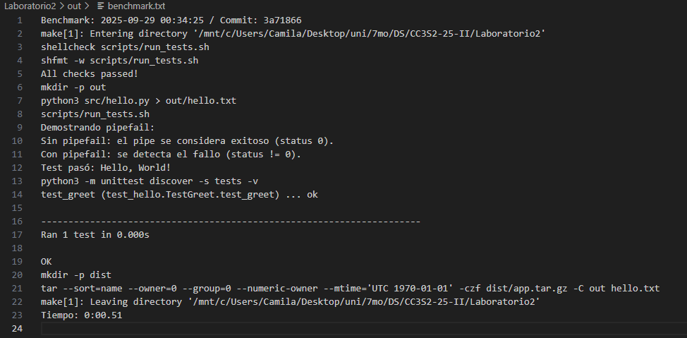
#### Checklist de Smoke-Tests - Bootstrap

Confirma permisos de ejecución del script, presencia de herramientas requeridas y ayuda autodocumentada. Espera que `make tools` falle temprano si falta una dependencia, con mensaje específico.
`make help` debe listar objetivos y descripciones extraídas de comentarios `##`, útil para *onboarding* y operación cotidiana.

```bash
chmod +x scripts/run_tests.sh
make tools
make help
```

#### Checklist de Smoke-Tests - Primera pasada

Construye, prueba, empaqueta. Verifica que `out/hello.txt` exista y que `dist/app.tar.gz` solo contenga `hello.txt`. El empaquetado usa flags deterministas (`--sort`, `--numeric-owner`, `--owner=0`, `--group=0`, `--mtime='UTC 1970-01-01'`) para reproducibilidad bit a bit.
Cualquier diferencia sugiere herramienta incompatible (BSD tar) o contaminación del entorno (TZ o metadatos).

```bash
make all
ls -l out/hello.txt dist/app.tar.gz
tar -tzf dist/app.tar.gz
```
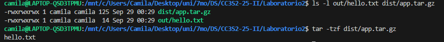
#### Checklist de Smoke-Tests - Incrementalidad

Compara tiempos entre ejecuciones consecutivas de `make benchmark`; la segunda debe ser más rápida por la caché de Make. Tras `touch src/hello.py`, espera reconstrucción de `build/test/package`.
Documenta el impacto en tiempos y explica cómo el grafo de dependencias dirige reconstrucciones mínimas necesarias.

```bash
make benchmark
make benchmark
touch src/hello.py
make benchmark
```
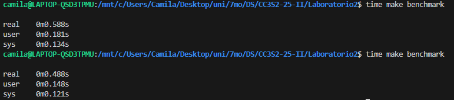
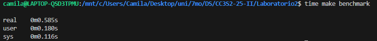
#### Checklist de Smoke-Tests - Rollback

Introduce un cambio que rompa la aserción del test del script Bash y ejecútalo. Observa "Test falló", creación de `.bak`, código de salida `2` y restauración automática por `trap`.
*(Precisión: si rompes el `print` para que no contenga "Hello, World!", fallará el script Bash y `make test` se detendrá **antes** de `python -m unittest`. la función `greet` en sí sigue siendo válida.)*

```python
# src/hello.py
print(greet("Mundo"))
```
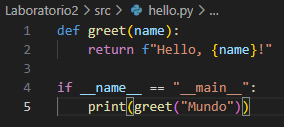
```bash
./scripts/run_tests.sh ; echo $?
git checkout -- src/hello.py
```
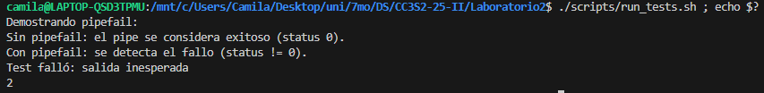
#### Checklist de Smoke-Tests - Lint y formato

Ejecuta `make lint` y corrige problemas de shell reportados por `shellcheck`. Aplica `make format` para normalizar estilo con `shfmt`. Si `ruff` está disponible, revisa `src` y corrige advertencias.
Mantén el build verde sin exigir `ruff` (guard clause), útil en máquinas heterogéneas.

```bash
make lint
make format
ruff check src || true
```
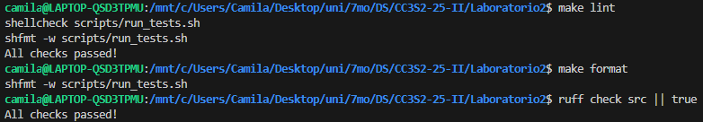
#### Checklist de Smoke-Tests - Limpieza

Asegura un entorno de compilación limpio y reproducible para CI y pruebas locales. `make dist-clean` elimina artefactos (`out/`, `dist/`) y cachés (`.ruff_cache`, `__pycache__`).
Luego, `make all` debe reconstruir todo desde cero sin depender de estado previo del árbol de trabajo.

```bash
make dist-clean
make all
```

#### Checklist de Smoke-Tests - Reproducibilidad

Valida que dos empaquetados consecutivos generen el mismo hash SHA256. Si difieren, revisa versión de `tar` (debe ser **GNU**), zona horaria (`TZ=UTC`), permisos y que no se cuelen archivos extra.
La verificación protege la cadena de suministro y evita *drift* entre desarrolladores y CI.

```bash
make verify-repro
```

#### Notas de portabilidad

* Usa **GNU tar** para reproducibilidad: `--sort=name`, `--numeric-owner`, `--owner=0`, `--group=0`, `--mtime='UTC 1970-01-01'`. Verifica artefactos con `sha256sum` (GNU coreutils). Evita BSD tar: carece de estos flags y rompe hashes en CI portables.
* Mantén `ruff` como opcional mediante *guard clause*: `command -v ruff >/dev/null && ruff check src || echo "ruff no instalado"`; evita fallos cuando no está disponible y continúa la build, reportando su ausencia.
* En WSL, trabaja en `~/proyecto` (o cualquier ruta Linux). Evita `/mnt/c` por I/O lento y diferencias de permisos; mejora tiempos y estabilidad de herramientas.
* El paralelismo con `make -j` es seguro porque cada receta crea su directorio objetivo con `mkdir -p $(@D)` y las dependencias evitan carreras.
* Incluye `out/`, `dist/`, `.ruff_cache/` y `**/__pycache__/` en `.gitignore` para evitar artefactos generados en commits y reducir ruido en diffs.
* Define (si te interesa CI) un objetivo `ci` que encadene `tools`, `check`, `package` y `verify-repro`; así validas dependencias, pruebas, empaquetado y reproducibilidad antes de subir cambios o crear tags.
* Para probar determinismo y detectar variables "fantasma", usa entornos mínimos: `env -i LC_ALL=C LANG=C TZ=UTC make ...`.


#### Entrega de la Actividad 5

Coloca **todas las respuestas y evidencias** de la *Actividad 5: Construyendo un pipeline DevOps con Make y Bash* en una carpeta en la **raíz del repositorio** llamada **`Actividad5-CC3S2`**. La entrega debe ser autocontenida y fácil de revisar.

#### 1) Estructura requerida

```
Actividad5-CC3S2/
├── README.md                 # Respuestas y explicación breve por ejercicio
├── logs/                     # Salidas de consola organizadas
│   ├── make-help.txt
│   ├── build-run1.txt
│   ├── build-run2.txt
│   ├── dry-run-build.txt
│   ├── make-d.txt
│   ├── fallo-python4.txt
│   ├── sha256-1.txt
│   ├── sha256-2.txt
│   └── sha256-diff.txt
├── evidencia/                # Evidencias puntuales (archivos/fragmentos)
│   ├── out-hello-run1.txt
│   ├── missing-separator.txt
│   └── notas.md              # (opcional) aclaraciones breves
├── artefactos/               # Copias de artefactos generados
│   ├── out/
│   │   └── hello.txt
│   └── dist/
│       └── app.tar.gz
└── meta/
    ├── entorno.txt           # Versiones (OS, Python, GNU tar, etc.)
    └── commit.txt            # SHA corto del repo (si usaste git)
```

> **Nota:** Los artefactos originales se generan en `out/` y `dist/` del proyecto,  copia los **finales** a `Actividad5-CC3S2/artefactos/` para la entrega.

#### 2) Contenido mínimo del `README.md` (dentro de `Actividad5-CC3S2/`)

Incluye secciones breves (3-8 líneas cada una) que respondan a lo pedido en el enunciado:

* **Resumen del entorno**: SO, shell, versiones de `make`, `bash`, `python3`, `tar` (indica si es **GNU tar**), `sha256sum`.
* **Parte 1-Construir**:

  * Explica qué hace `build` y cómo `$(PYTHON) $< > $@` usa `$<` y `$@`.
  * Menciona el **modo estricto** (`-e -u -o pipefail`) y `.DELETE_ON_ERROR`.
  * Diferencia entre la 1.ª y 2.ª corrida de `build` (idempotencia).
* **Parte 2-Leer**:

  * Qué observaste con `make -n` y `make -d` (decisiones de rehacer o no).
  * Rol de `.DEFAULT_GOAL`, `.PHONY` y ayuda autodocumentada.
* **Parte 3-Extender**:

  * Qué detectó `shellcheck`/`shfmt` (o evidencia de que no están instalados).
  * Demostración de **rollback** con `trap` (códigos de salida y restauración).
  * **Reproducibilidad**: factores que la garantizan (`--sort`, `--mtime`, `--numeric-owner`, `TZ=UTC`) y el resultado de `verify-repro`.
* **Incidencias y mitigaciones**: cualquier problema y cómo lo resolviste.
* **Conclusión operativa**: 2-3 líneas sobre por qué el pipeline es apto para CI/CD.

> Si alguna herramienta opcional no está disponible (p. ej., `ruff`), deja **evidencia** en `logs/` de su ausencia (mensaje claro) y continúa con el resto.

#### 3) Comprobación rápida antes de subir

* La carpeta **existe en la raíz** y contiene `README.md`.
* Están los directorios `logs/`, `evidencia/`, `artefactos/`, `meta/`.
* `artefactos/dist/app.tar.gz` **coincide** con el último build.
* `sha256-1.txt` y `sha256-2.txt` muestran **el mismo hash**.
* El `README.md` explica **cada ejercicio** en pocas líneas con referencia a sus evidencias.