### Laboratorio 11: DevSecOps total: Docker -> Cadena de suministro -> CI -> Kubernetes (local primero, reproducible)

**Nombre:** Ariana Camila Lopez Julcarima

**Fecha:** 14/12/2025 
**Video:** https://drive.google.com/drive/folders/1uBam-6WFYfLP8QoATsTtTYiOukLEB2sm?usp=sharing

### 1. Prerrequisitos

* **Docker** y **Docker Compose v2** **kubectl** y **Minikube**
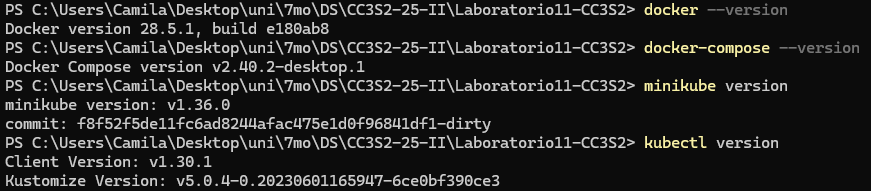

**syft**, **grype**, **cosign**
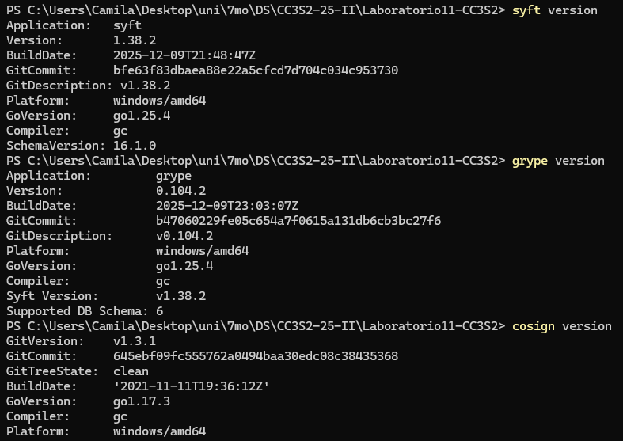


### 2. Preparación de entorno

# Variables comunes del laboratorio
centraliza nombres y tags `./scripts/env.sh`

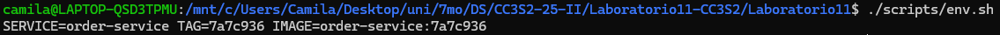

El makefile tambien  maneja automaticamene
```bash
make env SERVICE=user-service
```
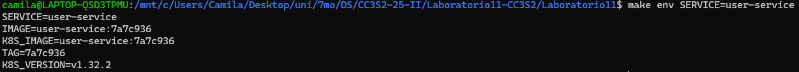


### 3. Desarrollo local (DEV) - pruebas con Docker Compose

En esta sección  compilar, levantar contenedor de prueba y comprobar `/health` con un contenedor `sut`.

#### 3.1 User Service

**Con Makefile**

```bash
make dev SERVICE=user-service
```
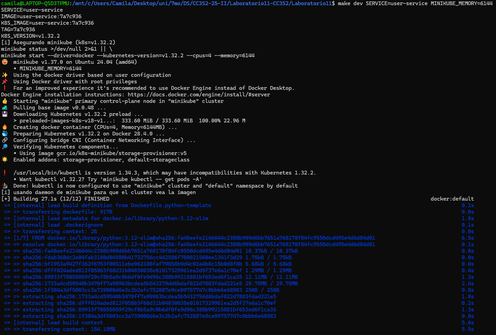
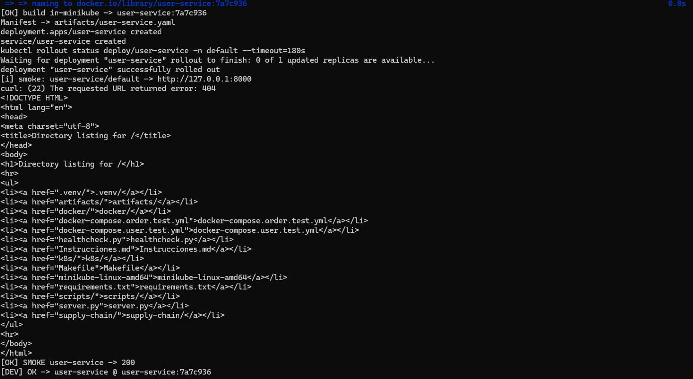

**Con Docker Compose (fallback)**

```bash
docker compose -f docker-compose.user.test.yml up --build --abort-on-container-exit --exit-code-from sut
```


#### 3.2 Order Service

**Con Makefile**

```bash
make dev SERVICE=order-service
```
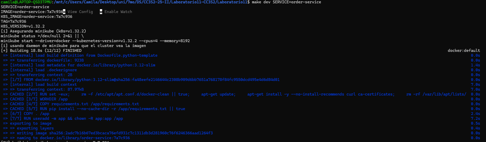

**Con Docker Compose (fallback)**

```bash
docker compose -f docker-compose.order.test.yml up --build --abort-on-container-exit --exit-code-from sut
```
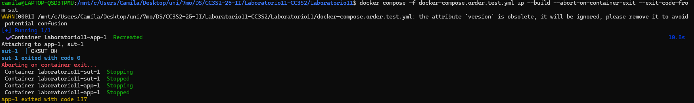


### 4. Supply Chain (SEC) - SBOM + SCA (SARIF + gate) + Firma

**Objetivo:** generar SBOM, ejecutar análisis de vulnerabilidades con **gate** y **firmar/verificar** la imagen.


#### 4.1 Generar SBOM

**Con Makefile**

```bash
make sbom SERVICE=user-service
```
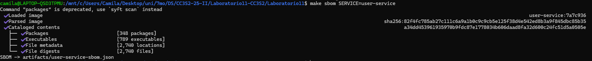

**Manual con Syft (si ya tienes un .tar)**

```bash
syft packages docker-archive:artifacts/user-service.tar -o json > artifacts/user-service-sbom.json
```
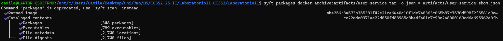


#### 4.2 SCA con gate (Grype -> SARIF)

**Con Makefile (gate estricto)**

```bash
SCAN_FAIL_SEVERITY=high make scan SERVICE=user-service
```
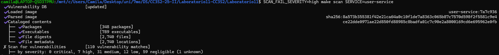


#### 4.3 Firma y verificación (Cosign) TODO

```bash
make sign SERVICE=user-service              # firma
COSIGN_VERIFY=1 make sign SERVICE=user-service  # firma + verify
```
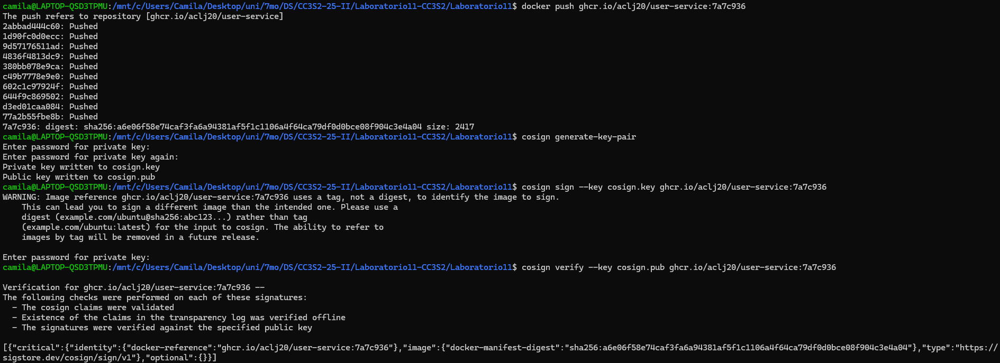
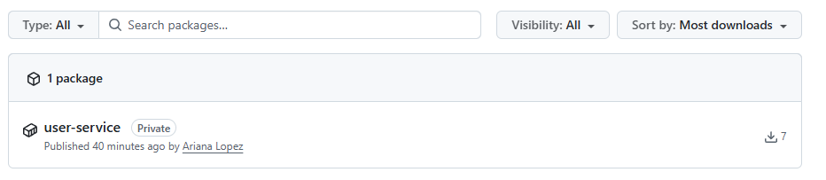
#### 4.4 Evidencias de supply chain

```bash
mkdir -p .evidence/sbom .evidence/scan .evidence/logs
cp artifacts/*sbom*.json .evidence/sbom/ 2>/dev/null || true
cp artifacts/*grype*.sarif .evidence/scan/ 2>/dev/null || true
bash scripts/muestra_salidas.sh
```
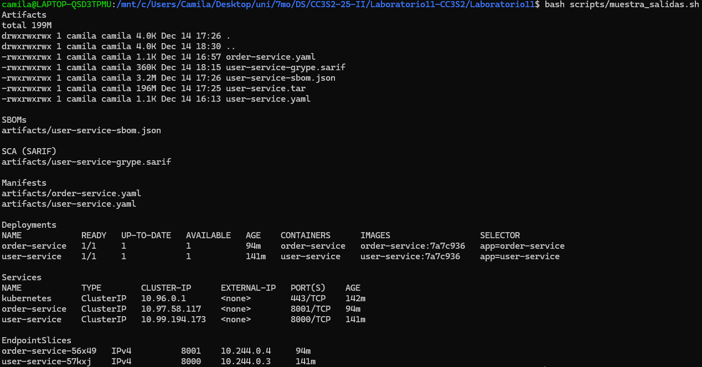


### 6. Despliegue en Kubernetes (OPS) - Minikube

**Objetivo:** desplegar **cada servicio** y validar `/health` desde el cluster.


#### Estrategia A - Construir dentro del daemon de Minikube

1. Construye las imágenes y aplica manifests

```bash
make build SERVICE=user-service
make build SERVICE=order-service
```


```bash
kubectl apply -f k8s/user-service/deployment-and-service.yaml
kubectl apply -f k8s/order-service/deployment-and-service.yaml
kubectl get deploy,svc,pod -o wide
```
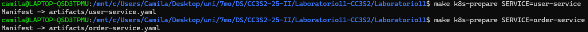
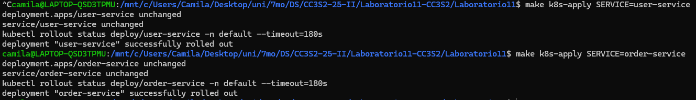
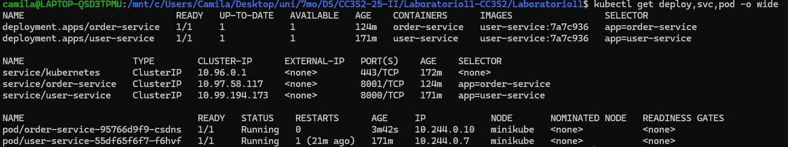


#### Verificación de readiness y health

**Smoke test por port-forward automático**

```bash
./scripts/minikube_smoke.sh user-service 8000
./scripts/minikube_smoke.sh order-service 8001
```
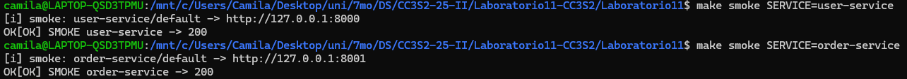


# Conclusión 
En este laboratorio aprendí cómo implementar una cadena de suministro de software segura utilizando contenedores y Kubernetes. Trabajé con imágenes Docker desde su construcción hasta su publicación en un registro confiable, generando un SBOM y reportes en formato SARIF para el análisis de vulnerabilidades. Además, firmé las imágenes con Cosign y verifiqué sus firmas para asegurar la integridad y autenticidad del software. Finalmente, validé el despliegue en Kubernetes revisando los logs y el estado de los Deployments, comprobando que los servicios se encontraban en ejecución y saludables. Todo este proceso me permitió entender cómo integrar prácticas de seguridad y trazabilidad dentro del flujo de desarrollo y despliegue.